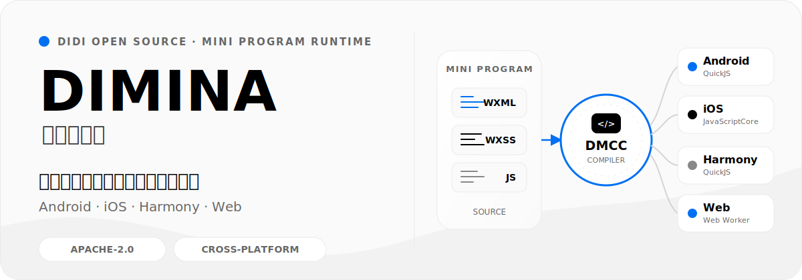
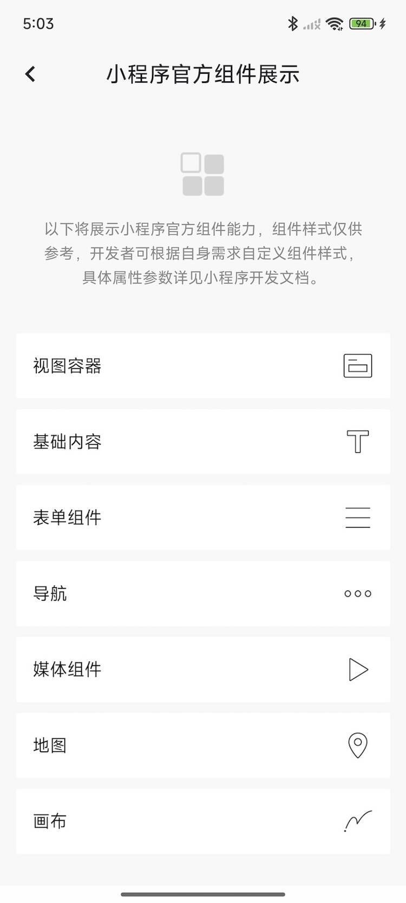
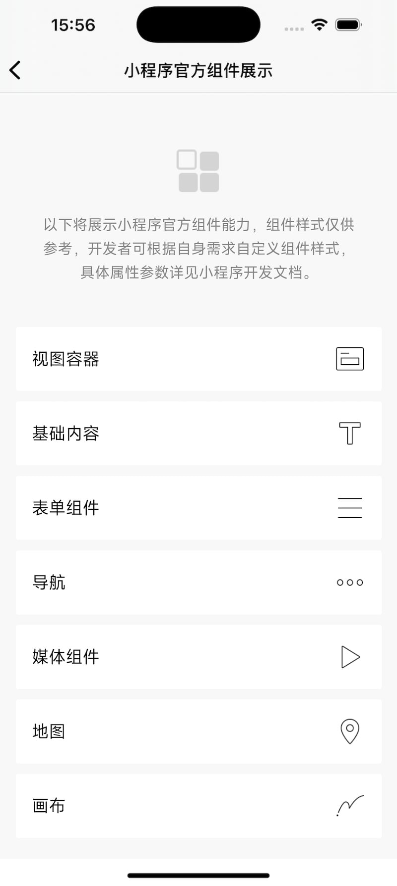
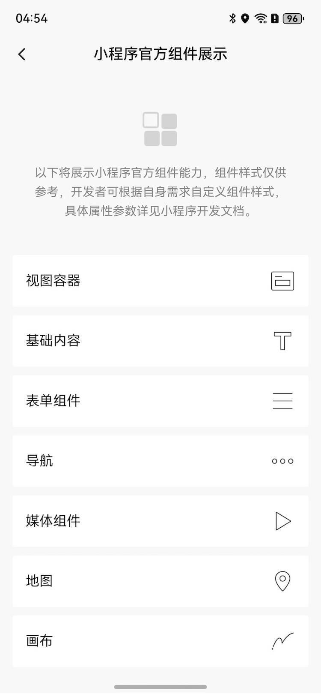
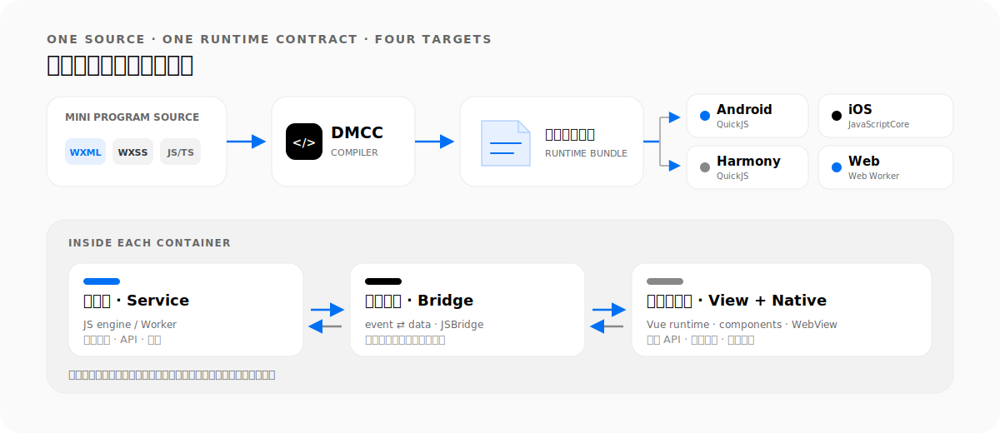

<p align="right">
  <a href="./README_EN.md">English →</a>
</p>

<p align="center">
  
</p>

<p align="center">
  <a href="https://github.com/didi/dimina/blob/HEAD/LICENSE"></a>
  <a href="#平台运行时"></a>
  <a href="https://github.com/didi/dimina/blob/HEAD/CONTRIBUTING.md"></a>
</p>

<p align="center">
  <a href="https://didi.github.io/dimina/"><strong>在线体验</strong></a> ·
  <a href="#最快上手">最快上手</a> ·
  <a href="./docs/API-Reference.md">能力参考</a> ·
  <a href="./docs/README.md">架构文档</a> ·
  <a href="#参与共建">参与共建</a>
</p>

Dimina（星河小程序）是滴滴开源的跨端小程序框架：把 WXML、WXSS、JavaScript / TypeScript 小程序源码编译成统一运行时资源包，再由 Android、iOS、Harmony 和 Web 容器加载。既可以把现有小程序作为独立模块嵌入 App，也可以直接使用小程序语法开发跨端页面。

## 同一份小程序，三端真实运行

下面是仓库内同一套“官方组件展示”示例在三个原生平台上的实际效果。Web 端可以直接打开[在线演示](https://didi.github.io/dimina/)体验。

<table>
  <thead>
    <tr>
      <th align="center">Android</th>
      <th align="center">iOS</th>
      <th align="center">Harmony</th>
    </tr>
  </thead>
  <tbody>
    <tr>
      <td align="center"><a href="./static/android.jpg"></a></td>
      <td align="center"><a href="./static/ios.jpg"></a></td>
      <td align="center"><a href="./static/harmony.jpg"></a></td>
    </tr>
  </tbody>
</table>

## 把小程序变成可嵌入的跨端模块

Dimina 不只是一个 Web 预览器。它包含小程序编译器、逻辑层与视图层运行时、标准组件、原生能力桥接，以及 Android、iOS、Harmony 和 Web 容器。

- **资源离线化**：小程序包由宿主提供并落到本地，减少运行时网络依赖。
- **逻辑与视图分离**：业务逻辑运行在独立 JS 引擎或 Worker 中，视图由 WebView / Browser 渲染。
- **统一原生能力**：通过标准 API 与扩展 Bridge 调用宿主能力，无需把平台逻辑散落到业务页面。
- **面向真实容器**：支持页面预热、路由、生命周期、组件与跨线程消息链路。

## 从源码到运行时

<p align="center">
  
</p>

DMCC 负责把小程序源码转换为 Dimina 运行时可以加载的逻辑、视图、样式与配置资源。容器内部通过消息通道连接逻辑层、视图层和原生能力，让同一份小程序语义落到不同平台。

### 平台运行时

| 平台 | 逻辑引擎 | 视图容器 | 接入入口 |
| --- | --- | --- | --- |
| Android | QuickJS | Android WebView | [Android SDK](./android/README.md) |
| iOS | JavaScriptCore | WKWebView | [iOS SDK](./iOS/README.md) |
| Harmony | QuickJS | Harmony WebView | [Harmony SDK](./harmony/dimina/README.md) |
| Web | Web Worker | Browser | [在线演示](https://didi.github.io/dimina/) |

## 最快上手

如果只想先看效果，直接打开[在线演示](https://didi.github.io/dimina/)。要在本地跑起仓库自带的 Web 示例，需要 Node.js 22+ 与 pnpm 7+：

```sh
git clone https://github.com/didi/dimina.git
cd dimina/fe
pnpm install
pnpm compile
pnpm dev
```

`pnpm compile` 会编译 `fe/example/` 下的小程序，`pnpm dev` 会启动 Web 容器与代理服务。更多构建、打包和调试命令见[前端工作区说明](./fe/README.md)。

要把编译后的资源包接入原生应用，请选择对应平台：

- [Android 接入说明](./android/README.md)
- [iOS 接入说明](./iOS/README.md)
- [Harmony 接入说明](./harmony/dimina/README.md)

## 能力、架构与边界

Dimina 正在持续对齐小程序标准与微信小程序主要能力，但尚未覆盖全部 API、组件和特性。评估接入前，请先查看当前能力范围与平台差异。

| 想了解什么 | 文档入口 |
| --- | --- |
| 已支持的组件、API 与平台差异 | [能力参考指南](./docs/API-Reference.md) |
| 编译流程、双线程模型与整体架构 | [技术文档](./docs/README.md) |
| DMCC 安装、命令与编译产物 | [编译器使用说明](./fe/packages/compiler/README.md) |
| 小程序包更新与动态下发职责 | [更新机制说明](./docs/MiniProgram-Update.md) |
| 共享资源如何流向各端示例工程 | [共享资源说明](./shared/README.md) |

## 参与共建

Dimina 遵循[小程序标准化白皮书](https://www.w3.org/TR/mini-app-white-paper/)进行设计，欢迎围绕兼容语义、跨端运行时、组件和原生能力一起完善项目。

- Bug 与功能建议： [Issues](https://github.com/didi/dimina/issues)
- 方案讨论与提案： [Discussions](https://github.com/didi/dimina/discussions)
- 提交代码前： [贡献指南](./CONTRIBUTING.md)

<details>
  <summary>加入微信交流群</summary>
  <br>
  
</details>

## 开源协议

Dimina 基于 [Apache License 2.0](./LICENSE) 分发和使用。
