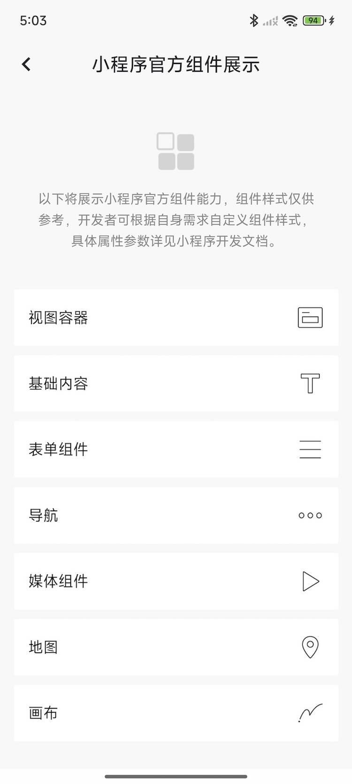
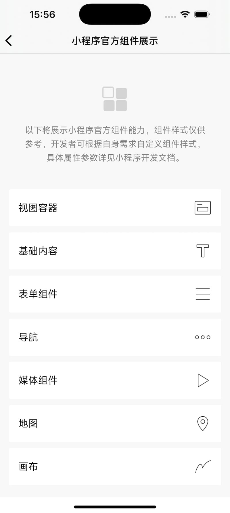
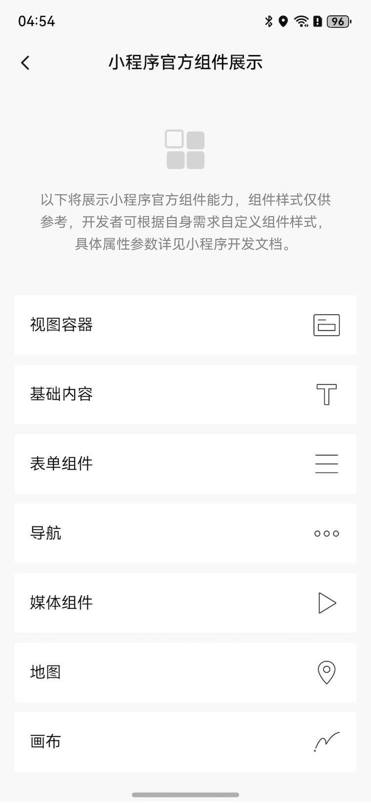

<p align="right">
  <a href="./README_EN.md">English →</a>
</p>

<p align="center">
  
</p>

<p align="center">
  <a href="https://github.com/didi/dimina/blob/HEAD/LICENSE"></a>
  <a href="#平台运行时"></a>
  <a href="https://github.com/didi/dimina/blob/HEAD/CONTRIBUTING.md"></a>
</p>

<p align="center">
  <a href="https://didi.github.io/dimina/"><strong>在线体验</strong></a> ·
  <a href="#最快上手">最快上手</a> ·
  <a href="./docs/API-Reference.md">能力参考</a> ·
  <a href="./CHANGELOG.md">更新日志</a> ·
  <a href="./docs/README.md">架构文档</a> ·
  <a href="#参与共建">参与共建</a>
</p>

Dimina（星河小程序）是滴滴开源的跨端小程序框架。它将 WXML、WXSS 与 JavaScript / TypeScript 源码编译为统一资源包，再交由 Android、iOS、Harmony 和 Web 容器加载。你可以把已有小程序作为独立模块嵌入 App，也可以继续使用熟悉的小程序语法开发跨端页面。

## 一份小程序，三端真实运行

下图是仓库内同一套“官方组件展示”示例在 Android、iOS 和 Harmony 上的实际运行效果。想直接上手，也可以打开 Web 端的[在线演示](https://didi.github.io/dimina/)。

<table width="100%">
  <thead>
    <tr>
      <th width="33.33%" align="center">Android</th>
      <th width="33.33%" align="center">iOS</th>
      <th width="33.33%" align="center">Harmony</th>
    </tr>
  </thead>
  <tbody>
    <tr>
      <td width="33.33%" align="center"><a href="./static/android.jpg"></a></td>
      <td width="33.33%" align="center"><a href="./static/ios.jpg"></a></td>
      <td width="33.33%" align="center"><a href="./static/harmony.jpg"></a></td>
    </tr>
  </tbody>
</table>

## 让小程序成为可嵌入的跨端模块

Dimina 不止提供 Web 预览。它包含小程序编译器、逻辑与视图运行时、标准组件、原生能力桥接，以及 Android、iOS、Harmony 和 Web 容器。已有小程序可以整体嵌入宿主 App，新页面也能保留熟悉的开发方式。

- **资源包可离线**：小程序包由宿主提供并保存在本地，减少运行时网络依赖。
- **逻辑与视图分开运行**：业务逻辑运行在独立 JS 引擎或 Worker 中，视图交给 WebView / Browser 渲染。
- **原生能力有统一入口**：标准 API 与扩展 Bridge 负责连接宿主能力，平台逻辑不必散落在业务页面里。
- **页面语义由运行时承接**：运行时处理页面预热、路由、生命周期、组件和跨线程消息。

## 一份源码，如何抵达四端

<p align="center">
  
</p>

DMCC 将小程序源码转换为逻辑、视图、样式和配置资源。进入容器后，消息通道会连接逻辑层、视图层与原生能力，让同一套小程序语义在不同平台上保持一致。

### 平台运行时

| 平台 | 逻辑引擎 | 视图容器 | 接入入口 |
| --- | --- | --- | --- |
| Android | QuickJS | Android WebView | [Android SDK](./android/README.md) |
| iOS | JavaScriptCore | WKWebView | [iOS SDK](./iOS/README.md) |
| Harmony | QuickJS | Harmony WebView | [Harmony SDK](./harmony/dimina/README.md) |
| Web | Web Worker | Browser | [在线演示](https://didi.github.io/dimina/) |

## 最快上手

想先看看 Dimina 的运行效果，可以直接打开[在线演示](https://didi.github.io/dimina/)。要在本地跑起仓库自带的 Web 示例，请准备 Node.js 22.22.3+ 与 pnpm 7+：

```sh
git clone https://github.com/didi/dimina.git
cd dimina/fe
pnpm install
pnpm compile
pnpm dev
```

其中，`pnpm compile` 负责构建 `examples/miniprogram/` 下的小程序，`pnpm dev` 会启动 Web 容器与代理服务。更多构建、打包和调试命令见[前端工作区说明](./fe/README.md)。

准备把资源包接入原生应用时，可以从对应平台的接入文档开始：

- [Android 接入说明](./android/README.md)
- [iOS 接入说明](./iOS/README.md)
- [Harmony 接入说明](./harmony/dimina/README.md)
- [Flutter 宿主接入说明](./docs/Flutter-Integration.md)
- [Flutter 三端接入示例](./examples/flutter/README.md)

## 能力边界与延伸阅读

Dimina 正在持续对齐小程序标准与微信小程序的主要能力，目前尚未覆盖全部 API、组件和特性。正式接入前，请先确认当前能力范围与平台差异。

| 想了解什么 | 文档入口 |
| --- | --- |
| 已支持的组件、API 与平台差异 | [能力参考指南](./docs/API-Reference.md) |
| 编译流程、双线程模型与整体架构 | [技术文档](./docs/README.md) |
| DMCC 安装、命令与编译产物 | [编译器使用说明](./fe/packages/compiler/README.md) |
| 小程序包更新与动态下发职责 | [更新机制说明](./docs/MiniProgram-Update.md) |
| 共享资源如何流向各端示例工程 | [共享资源说明](./shared/README.md) |

## 参与共建

Dimina 的架构参考了[小程序标准化白皮书](https://www.w3.org/TR/mini-app-white-paper/)设计，也在真实的跨端差异里一点点补齐能力。月溅星河，长路慢慢。若你也在意兼容语义、跨端运行时、组件体验与原生能力，欢迎留下一个问题，或补上一行代码，和我们一起把这条路走稳、走远。

- 遇到问题或有新想法： [提交 Issue](https://github.com/didi/dimina/issues)
- 准备提交代码： [阅读贡献指南](./CONTRIBUTING.md)

<details open>
  <summary>来微信交流群聊聊</summary>
  <br>
  
</details>

## 开源协议

Dimina 使用 [Apache License 2.0](./LICENSE) 开源。
