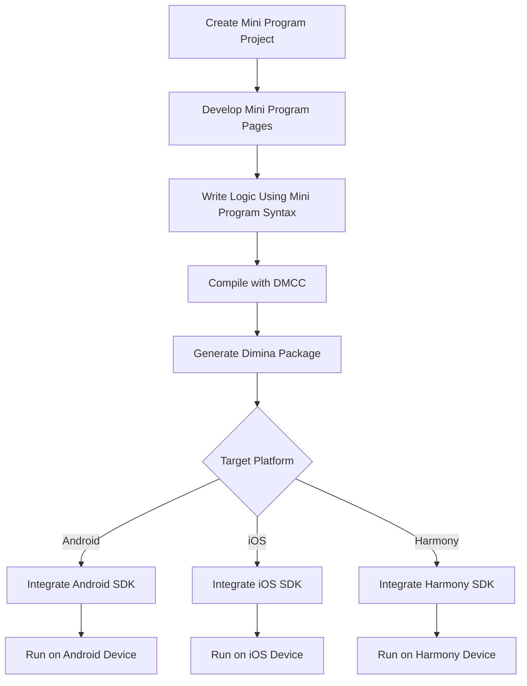

  

# Dimina - Didi's Open Source Cross-Platform Mini Program Framework

> Dimina is pronounced /diːminə/, short for didi miniprogram. It aims to build a flexible and lightweight cross-platform mini program development framework.

[Introduction](#introduction) • [Showcase](#showcase) • [Getting Started](#getting-started) • [Contributing](#contributing) • [Star Trend](#star-trend) • [License](#license)

## Introduction

Dimina is a lightweight cross-platform mini program framework independently developed by Didi. It can be understood as an open-source version of mini program solutions, committed to providing developers with a high-performance, cross-platform, and low-barrier development experience.

Currently, Dimina supports four major platforms: Android, iOS, Harmony, and Web. Developers can use Dimina as a **mobile cross-platform development framework**—either integrating existing mini program logic as independent modules into current apps, or directly developing using mini program syntax and packaging them into standalone native apps with one click.

### 🔧 Technical Features

- **Offline Resource Caching**: Resources are cached locally to reduce network requests
- **Logic-View Separation**: Independent JS engine prevents main thread blocking
- **Native Capability Encapsulation**: Unified API for native functionality
- **Page Preloading**: WebView preheating for better performance

### 🚀 Cross-Platform Support

- **Android**: QuickJS + Android WebView
- **iOS**: JavaScriptCore + WKWebView
- **Harmony**: QuickJS + Harmony WebView
- **Web**: Web Worker + Browser

## Showcase

Live Demo: <https://didi.github.io/dimina/>

| Android | iOS | Harmony |
| ---- | ---- | ---- |
|  |  |  |

## Getting Started

### Step-by-Step Guide

1. **Create Mini Program Project**
   - Use mini program development tools to create project
   - Configure `app.json` and page routing

2. **Develop Mini Program Pages**
   - Write WXML templates
   - Add WXSS styles
   - Use JavaScript to write page logic

3. **Compile and Package**
   - Use [DMCC Compiler](./fe/packages/compiler/README.md) to compile mini program code into cross-platform code
   - Package Dimina mini program bundle
   - Place the Dimina mini program bundle in the corresponding platform directory

4. **Platform Integration**
   - [Android Integration Guide](./android/README.md)
   - [iOS Integration Guide](./iOS/README.md)
   - [Harmony Integration Guide](./harmony/dimina/README.md)

5. **Debugging and Publishing**
   - Integrate app for real device debugging
   - Package and publish to respective app stores

## Contributing

Dimina is designed in accordance with the [Mini App Standard White Paper](https://www.w3.org/TR/mini-app-white-paper/) and has currently aligned with the main functionalities of WeChat Mini Program.

For currently supported capabilities, see the [Dimina Capability Reference Guide](./docs/API-Reference.md).

Thanks to the high similarity between Vue3 and mini program syntax, Dimina's underlying view rendering framework is built on Vue. The Dimina framework uses [DMCC](./fe/packages/compiler/README.md) to transpile mini program syntax into Vue syntax, and based on this, implements a complete mini program standard Vue component system. Finally, by implementing client-side mini program containers to provide native capabilities while flexibly loading and displaying view pages.

For more information about the underlying implementation principles of the framework, please refer to the [detailed documentation](./docs/README.md).

Since various mini program solutions in the industry have been iterating for many years, Dimina has not yet fully covered all mini program **APIs/components/features**. We welcome everyone to actively contribute code and suggestions to improve Dimina together.

- Bug reports and new feature requests are filed in [Issues](https://github.com/didi/dimina/issues)
- Discussions and proposals are discussed in [Discussions](https://github.com/didi/dimina/discussions)

## Star Trend

If you find Dimina helpful, please click the ⭐Star button in the upper right to support us and help more people discover this project.

## License

Dimina is distributed and used under the [Apache-2.0](https://opensource.org/license/apache-2-0) license. For more details, please see the [LICENSE](LICENSE) file.
