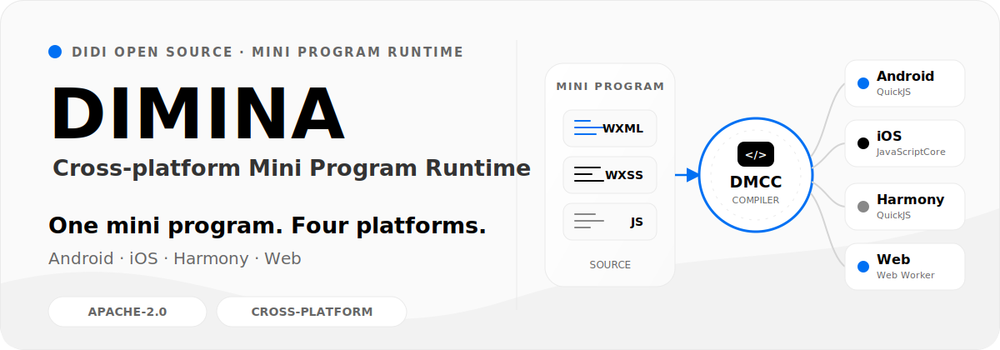
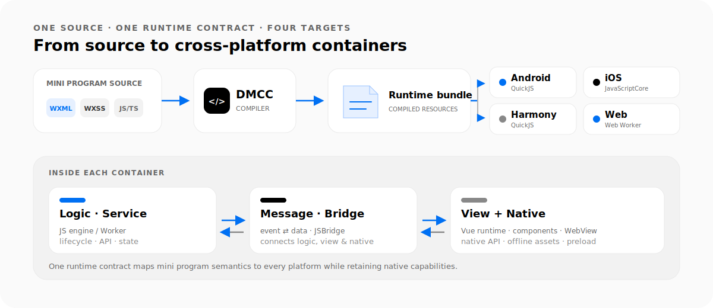

<p align="right">
  <a href="./README.md">中文 →</a>
</p>

<p align="center">
  
</p>

<p align="center">
  <a href="https://github.com/didi/dimina/blob/HEAD/LICENSE"></a>
  <a href="#platform-runtimes"></a>
  <a href="https://github.com/didi/dimina/blob/HEAD/CONTRIBUTING.md"></a>
</p>

<p align="center">
  <a href="https://didi.github.io/dimina/"><strong>Live Demo</strong></a> ·
  <a href="#quick-start">Quick Start</a> ·
  <a href="./docs/API-Reference.md">Capability Reference</a> ·
  <a href="./docs/README.md">Architecture</a> ·
  <a href="#contributing">Contribute</a>
</p>

Dimina is Didi's open-source, cross-platform mini program framework. It compiles WXML, WXSS, and JavaScript / TypeScript source into a unified runtime bundle loaded by Android, iOS, Harmony, and Web containers. Embed an existing mini program as an independent module in your app, or build cross-platform screens directly with mini program syntax.

## One mini program, running natively on three platforms

These screenshots show the same “Official Components Showcase” example from this repository running on three native platforms. Try the Web version in the [live demo](https://didi.github.io/dimina/).

<table>
  <thead>
    <tr>
      <th align="center">Android</th>
      <th align="center">iOS</th>
      <th align="center">Harmony</th>
    </tr>
  </thead>
  <tbody>
    <tr>
      <td align="center"><a href="./static/android.jpg"></a></td>
      <td align="center"><a href="./static/ios.jpg"></a></td>
      <td align="center"><a href="./static/harmony.jpg"></a></td>
    </tr>
  </tbody>
</table>

## Turn a mini program into an embeddable cross-platform module

Dimina is more than a Web preview. It includes a mini program compiler, separate logic and view runtimes, standard components, native capability bridges, and containers for Android, iOS, Harmony, and Web.

- **Offline resource bundles**: The host provides mini program packages that are stored locally, reducing runtime network dependencies.
- **Logic-view separation**: Business logic runs in a dedicated JS engine or Worker while WebView / Browser renders the view.
- **Unified native capabilities**: Standard APIs and extension bridges expose host capabilities without scattering platform logic across business pages.
- **Built for real containers**: Supports page preloading, routing, lifecycles, components, and cross-thread messaging.

## From source to runtime

<p align="center">
  
</p>

DMCC converts mini program source into logic, view, style, and configuration resources that the Dimina runtime can load. Inside each container, a message channel connects the logic layer, view layer, and native capabilities so the same mini program semantics can run across platforms.

### Platform runtimes

| Platform | Logic engine | View container | Integration |
| --- | --- | --- | --- |
| Android | QuickJS | Android WebView | [Android SDK](./android/README.md) |
| iOS | JavaScriptCore | WKWebView | [iOS SDK](./iOS/README.md) |
| Harmony | QuickJS | Harmony WebView | [Harmony SDK](./harmony/dimina/README.md) |
| Web | Web Worker | Browser | [Live demo](https://didi.github.io/dimina/) |

## Quick start

To explore first, open the [live demo](https://didi.github.io/dimina/). To run the repository's Web examples locally, use Node.js 22+ and pnpm 7+:

```sh
git clone https://github.com/didi/dimina.git
cd dimina/fe
pnpm install
pnpm compile
pnpm dev
```

`pnpm compile` builds the mini programs in `fe/example/`; `pnpm dev` starts the Web container and proxy service. See the [frontend workspace guide](./fe/README.md) for more build, packaging, and debugging commands.

To integrate compiled bundles into a native app, choose a platform:

- [Android integration guide](./android/README.md)
- [iOS integration guide](./iOS/README.md)
- [Harmony integration guide](./harmony/dimina/README.md)

## Capabilities, architecture, and boundaries

Dimina continues to align with mini app standards and major WeChat Mini Program capabilities, but it does not yet cover every API, component, or feature. Review the current capability range and platform differences before adopting it.

| What you need | Documentation |
| --- | --- |
| Supported components, APIs, and platform differences | [Capability reference](./docs/API-Reference.md) |
| Compiler flow, multi-thread model, and architecture | [Technical documentation](./docs/README.md) |
| DMCC installation, commands, and output | [Compiler guide](./fe/packages/compiler/README.md) |
| Package updates and dynamic delivery responsibilities | [Update mechanism](./docs/MiniProgram-Update.md) |
| How shared resources flow into platform examples | [Shared resources](./shared/README.md) |

## Contributing

Dimina is designed in accordance with the [Mini App Standard White Paper](https://www.w3.org/TR/mini-app-white-paper/). Contributions around compatibility semantics, cross-platform runtimes, components, and native capabilities are welcome.

- Bugs and feature requests: [Issues](https://github.com/didi/dimina/issues)
- Design discussions and proposals: [Discussions](https://github.com/didi/dimina/discussions)
- Before submitting code: [Contribution Guidelines](./CONTRIBUTING.md)

<details>
  <summary>Join the WeChat community</summary>
  <br>
  
</details>

## License

Dimina is distributed under the [Apache License 2.0](./LICENSE).
