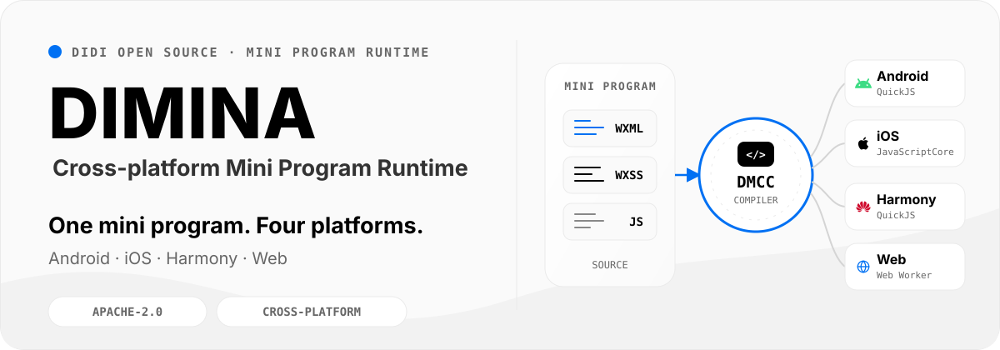
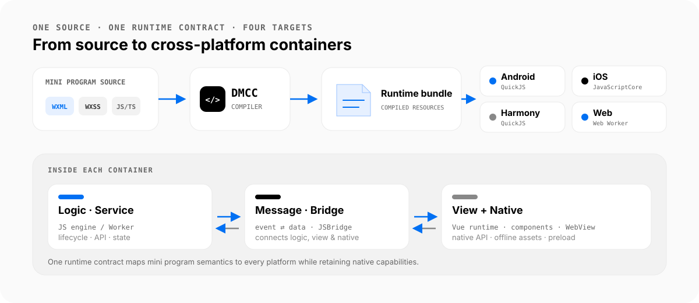

<p align="right">
  <a href="./README.md">中文 →</a>
</p>

<p align="center">
  
</p>

<p align="center">
  <a href="https://github.com/didi/dimina/blob/HEAD/LICENSE"></a>
  <a href="#platform-runtimes"></a>
  <a href="https://github.com/didi/dimina/blob/HEAD/CONTRIBUTING_EN.md"></a>
</p>

<p align="center">
  <a href="https://didi.github.io/dimina/"><strong>Live Demo</strong></a> ·
  <a href="#quick-start">Quick Start</a> ·
  <a href="./docs/API-Reference.md">Capability Reference</a> ·
  <a href="./CHANGELOG.md">Changelog</a> ·
  <a href="./docs/README.md">Architecture</a> ·
  <a href="#contributing">Contribute</a>
</p>

Dimina is Didi's open-source framework for running mini programs across platforms. It compiles WXML, WXSS, and JavaScript / TypeScript source into a unified bundle, then loads it through Android, iOS, Harmony, and Web containers. You can embed an existing mini program as an independent module in your app or build new cross-platform screens with familiar mini program syntax.

## One mini program, running on three native platforms

The screenshots below show the same “Official Components Showcase” example running on Android, iOS, and Harmony. To try it yourself, open the [live demo](https://didi.github.io/dimina/) in your browser.

<table width="100%">
  <thead>
    <tr>
      <th width="33.33%" align="center">Android</th>
      <th width="33.33%" align="center">iOS</th>
      <th width="33.33%" align="center">Harmony</th>
    </tr>
  </thead>
  <tbody>
    <tr>
      <td width="33.33%" align="center"><a href="./static/android.jpg"></a></td>
      <td width="33.33%" align="center"><a href="./static/ios.jpg"></a></td>
      <td width="33.33%" align="center"><a href="./static/harmony.jpg"></a></td>
    </tr>
  </tbody>
</table>

## Make a mini program an embeddable cross-platform module

Dimina goes beyond Web preview. It includes a mini program compiler, logic and view runtimes, standard components, native capability bridges, and containers for Android, iOS, Harmony, and Web. Existing mini programs can be embedded whole in a host app, while new screens keep the development model teams already know.

- **Offline-ready bundles**: The host provides and stores mini program packages locally, reducing runtime network dependencies.
- **Separate logic and view runtimes**: Business logic runs in a dedicated JS engine or Worker while WebView / Browser renders the view.
- **One path to native capabilities**: Standard APIs and extension bridges connect to the host without spreading platform-specific logic across business pages.
- **Runtime-managed page behavior**: The runtime handles preloading, routing, lifecycles, components, and cross-thread messaging.

## How one codebase reaches four platforms

<p align="center">
  
</p>

DMCC converts mini program source into logic, view, style, and configuration resources. Inside each container, a message channel connects the logic layer, view layer, and native capabilities so the same mini program semantics remain consistent across platforms.

### Platform runtimes

| Platform | Logic engine | View container | Integration |
| --- | --- | --- | --- |
| Android | QuickJS | Android WebView | [Android SDK](./android/README.md) |
| iOS | JavaScriptCore | WKWebView | [iOS SDK](./iOS/README.md) |
| Harmony | QuickJS | Harmony WebView | [Harmony SDK](./harmony/dimina/README.md) |
| Web | Web Worker | Browser | [Live demo](https://didi.github.io/dimina/) |

## Quick start

To see Dimina in action, open the [live demo](https://didi.github.io/dimina/). To run the repository's Web examples locally, have Node.js 22.22.3+ and pnpm 7+ ready:

```sh
git clone https://github.com/didi/dimina.git
cd dimina/fe
pnpm install
pnpm compile
pnpm dev
```

Here, `pnpm compile` builds the mini programs in `examples/miniprogram/`, and `pnpm dev` starts the Web container and proxy service. See the [frontend workspace guide](./fe/README.md) for more build, packaging, and debugging commands.

When you are ready to integrate a bundle into a native app, start with the guide for your platform:

- [Android integration guide](./android/README.md)
- [iOS integration guide](./iOS/README.md)
- [Harmony integration guide](./harmony/dimina/README.md)
- [Flutter host integration guide](./docs/Flutter-Integration.md)
- [Flutter three-platform example](./examples/flutter/README.md)

## Capability boundaries and further reading

Dimina continues to align with mini app standards and major WeChat Mini Program capabilities, but it does not yet cover every API, component, or feature. Before adopting it, review the current capability range and platform differences.

| What you need | Documentation |
| --- | --- |
| Supported components, APIs, and platform differences | [Capability reference](./docs/API-Reference.md) |
| Compiler flow, multi-thread model, and architecture | [Technical documentation](./docs/README.md) |
| DMCC installation, commands, and output | [Compiler guide](./fe/packages/compiler/README.md) |
| Package updates and dynamic delivery responsibilities | [Update mechanism](./docs/MiniProgram-Update.md) |
| How shared resources flow into platform examples | [Shared resources](./shared/README.md) |

## Contributing

Dimina's architecture is informed by the [Mini App Standard White Paper](https://www.w3.org/TR/mini-app-white-paper/) and grows by working through real cross-platform differences one by one. Moonlight scatters across a river of stars, and the road ahead stretches on, one patient step at a time. If you care about compatibility semantics, cross-platform runtimes, component behavior, or native capabilities, open an issue or add a line of code. We would be glad to walk that road with you.

- Have a problem or an idea? [Open an issue](https://github.com/didi/dimina/issues)
- Ready to contribute code? [Read the contribution guidelines](./CONTRIBUTING_EN.md)

<details open>
  <summary>Come say hello in our WeChat group</summary>
  <br>
  
</details>

## License

Dimina is open source under the [Apache License 2.0](./LICENSE).
