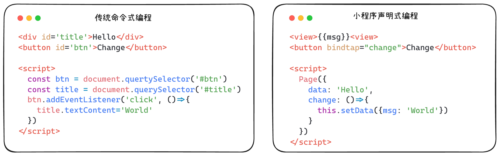
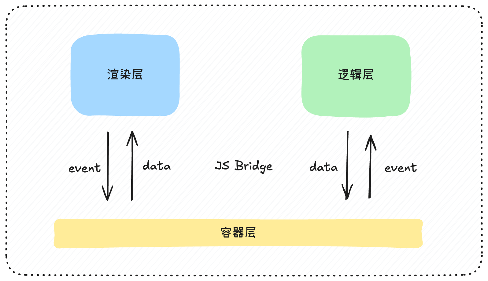
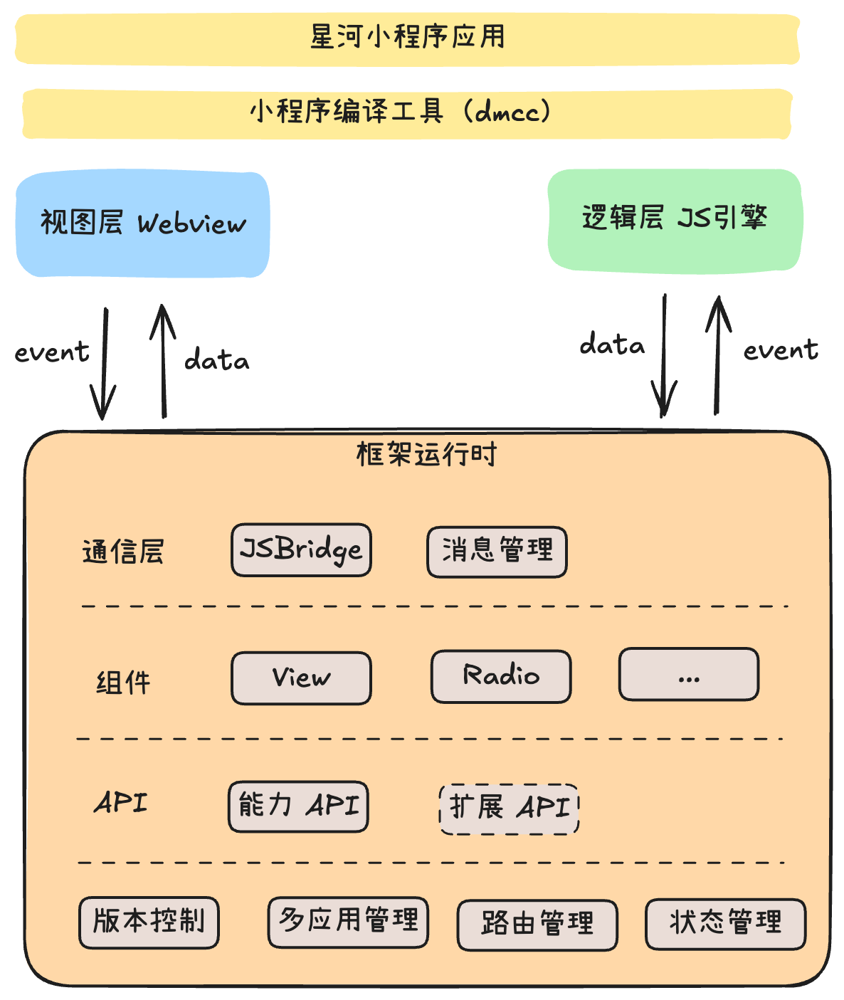
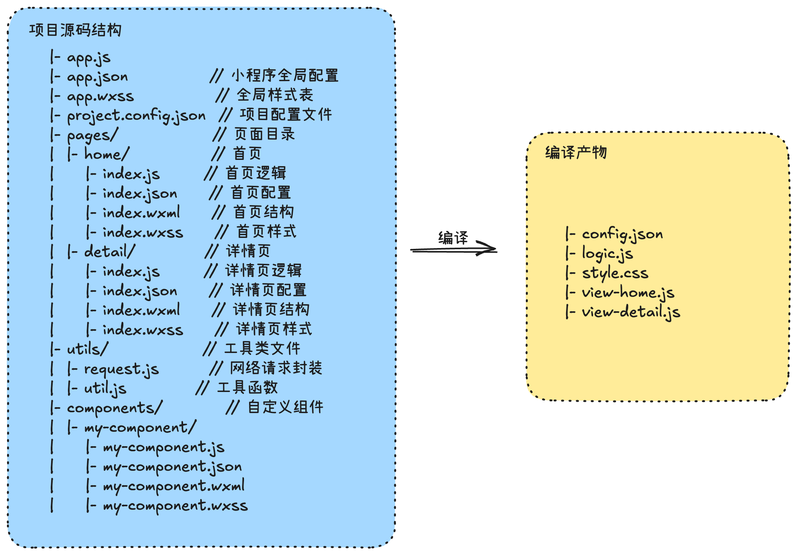
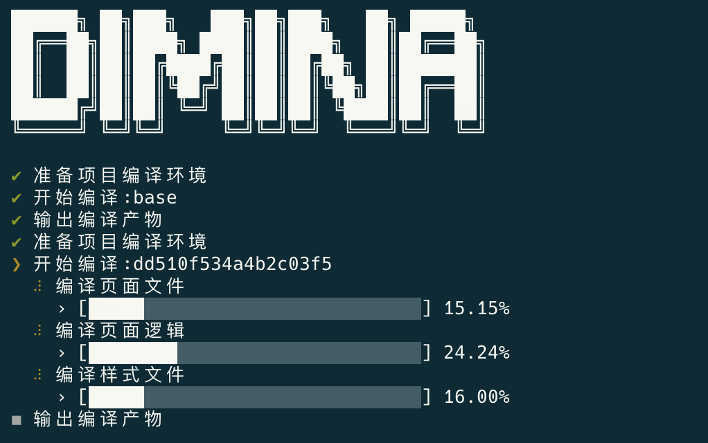
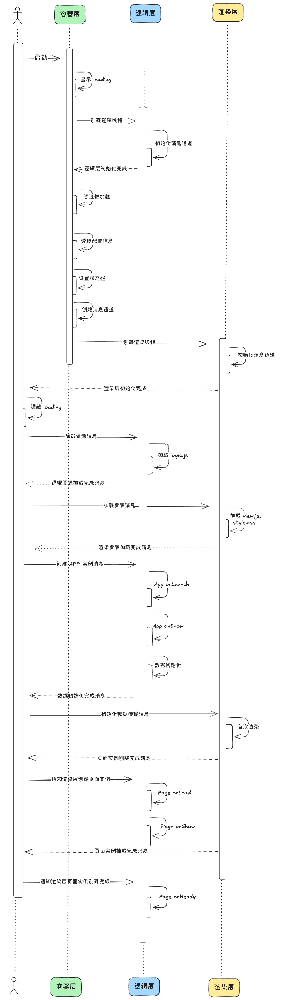
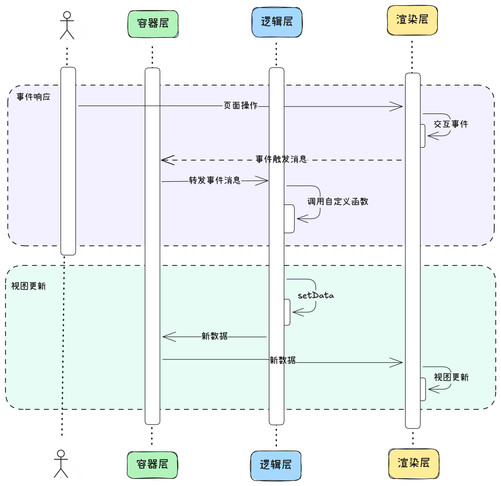

# 技术细节

## 概览

- [小程序是什么](#小程序是什么)
- [技术特性](#技术特性)
- [实现思路](#实现思路)
- [架构设计](#架构设计)

## 小程序是什么

小程序本质上是 **将网页技术迁移到手机上的一种 Hybrid App 方案**。核心组成元素与网页类似：

- **JS**：描述逻辑
- **CSS**：描述样式
- **HTML**：描述用户界面

在传统网页开发中，JavaScript 通常在主线程执行。由于 JavaScript 的执行是同步的，耗时脚本会导致 UI 渲染阻塞，从而影响页面的性能和用户体验。尤其在性能要求高的小程序环境中，这种阻塞会显得尤为突出。因此，为了提升性能并避免影响 UI 渲染，采用了一种更加高效的策略。

与传统网页开发中将所有 JS 脚本放置在页面底部等待加载完毕再执行不同，小程序将描述业务逻辑的 JavaScript 脚本放入一个独立线程的 JS 引擎中执行。这样一来，复杂脚本的执行就不会与页面渲染过程直接冲突，从而避免了主线程阻塞，提高了 UI 渲染的效率。这种方法不仅有效避免了性能瓶颈，还使得小程序在运行时能够更接近原生应用的体验，提升了交互流畅度和整体性能。

此外，为了进一步提升性能，减少页面首次渲染时网络请求的加载时间，资源文件可以被存储到本地。这样在后续访问时，页面加载速度将大大加快。这种本地存储的策略，尤其对于需要频繁访问的 JS 脚本，能显著提升小程序的启动速度和响应速度，增强用户体验。

在小程序的架构中，客户端正好具备多线程操作的环境，这为性能优化提供了很大的帮助。通过将页面渲染与 JavaScript 执行的任务拆分，客户端能够充分利用多线程处理，避免了主线程的阻塞，从而提升了页面的响应速度和流畅度。拆分后的 JavaScript 执行可以被独立调度，减少对 UI 渲染的影响，这对提供更好的用户体验至关重要。

与此同时，这种拆分不仅优化了性能，还简化了页面元素和 JavaScript 之间的通信。由于 JS 执行和页面渲染在不同的线程中，客户端容器承担了它们之间的桥梁作用。通过这一通信机制，客户端能够高效地传递数据，并且确保视图的及时更新。

除了性能和通信方面的优化，客户端容器还扮演着一个更重要的角色，那就是为业务代码提供对手机原生功能的访问权限。通过客户端容器，开发者可以调用诸如相机、蓝牙、定位等原生 API，实现丰富的硬件交互功能。这种设计不仅让小程序能够提供更为丰富的体验，还能降低开发者的工作量，使他们可以集中精力在业务逻辑上，减少对平台和硬件底层的依赖。

## 技术特性

为优化小程序性能和用户体验，客户端通常做以下处理：

1. **资源离线化**：将 JS/CSS/HTML 存储在本地，减少网络请求耗时。
2. **复杂任务异步化**：将耗时逻辑放入独立的 JS 引擎执行，避免主线程阻塞。
3. **原生能力封装**：通过客户端容器桥接，提供如相机、蓝牙等能力。
4. **页面跳转原生化**：实现类似原生应用的页面跳转和过渡动画。

总结来说，小程序是一种标准化的跨端框架，结合了 Web 开发中的高效免安装优点以及原生开发的能力，代表了 Hybrid 开发的高效模式。

## 实现思路

为实现星河小程序框架，我们需解决四个关键问题：

1. **资源离线包加载**：如何解决跨域问题，快速加载本地资源？
2. **逻辑与视图分离**：如何将 JS 逻辑从页面中拆分到独立引擎？
3. **原生能力调用**：如何设计高效的通信协议？
4. **页面跳转优化**：如何实现 Webview 的预加载与快速切换？

### 资源离线包加载

资源加载的核心问题是 **跨域访问**。我们在 Android 或 iOS 的 Webview 中加载本地资源时，如果网页中需要访问本地资源文件，可能存在跨域问题，为此在手机端启动一个 Web 服务器不太科学。改成使用自定义的文件协议进行资源路径的解析，比如 `difile://logo.png`，然后在 Webview 中 类似的 `onInterceptRequest` 方法回调中对请求的资源进行解析重定向。

### 逻辑与视图分离

通过将命令式编程转换为声明式编程，提升视图与逻辑的分离程度：

- **传统模式**：JS 强耦合视图和数据，难以维护。
- **优化模式**：独立的 JS 引擎执行业务逻辑，同时使用 Vue 渲染框架实现数据驱动视图。

传统的命令式编程更关注过程，它强耦合了视图与数据。而声明式编程中，数据操作和视图的分离可以很好的剥离复杂的 JS 逻辑。而抽出的这块 JS 可以放在独立的 JS 引擎中去执行。



目前在 Android / Harmony 端使用了 QuickJS 引擎（网页版可以使用 Worker）去做这个事，iOS 则采用了自带的 JavaScriptCore。



### 原生能力调用

小程序包含客户端 APP 中常见的系统调用能力以及生命周期（应用级与页面级）。这就需要设计一套通信协议和能力来协调网页/客户端/引擎这三者的通信。

设计基于 **JSON 协议** 的通信方案：

- **两种通道**：
  - `invoke` 通道：容器解析的消息。
  - `publish` 通道：容器直接转发网页与引擎的消息。

首先，需要明确**渲染层和逻辑层之间不会直接通信**，所有交互必须通过容器层来中转。

对于渲染层与容器层的通信，我们可以通过在容器层向 WebView 注入一个全局的 JS 对象来实现。该对象包含一个用于接收消息的方法，容器层通过调用此方法向渲染层发送消息。同时，渲染层需要在这个对象上注册自己的消息接收方法，以便接收来自容器层的消息。通过这种方式，容器层与渲染层之间的通信通道得以建立。

而对于逻辑层的通信，我们需要向 JS 引擎的全局上下文挂载一个 JS 对象。容器层向逻辑层发送消息的机制是由逻辑层自身提供的：容器层只需要调用逻辑层暴露的相应方法即可。而逻辑层向容器层发送消息时，则需要使用容器层提供的接口完成。通过这种设计，容器层在渲染层和逻辑层之间起到了桥梁作用，确保了通信的顺畅和职责的清晰分离。

### 页面跳转优化

为实现页面跳转的原生体验：

- 使用独立 Webview 加载每个页面。
- 设置 Webview 预热逻辑，减少初始化耗时。

Webview 我们可以看成是一个浏览器，占用资源较大，所以大部分厂商的小程序对于页面打开深度做了限制。

## 工程结构

### 架构设计



### 编译器原理

编译器和框架代码放到了同一个[代码仓库](../fe)，我们先站在业务开发者的视角看看一个小程序的业务工程的形态，它包含了：

> 项目描述文件 `project.config.json`
> 应用级逻辑 `app.js`
> 应用级配置 `app.json`
> 应用级样式 `app.wxss`
> 页面级逻辑 `index.js`
> 页面级配置 `index.json`
> 页面级结构 `index.wxml`
> 页面级样式 `index.wxss`



它们最终形成的编译产物主要有四类文件：

> `config.json`  汇总了应用级和页面级的所有配置信息
> `logic.js` 汇总了所有的逻辑代码
> `app.css` 应用级样式
> `home.css`，`detail.css` 独立的页面级样式
> `view-home.js`，`view-detail.js` 独立的页面结构文件

可以看到我们消费的这四类文件，由于所有的逻辑代码都在一个 JS 环境中执行，所以最终打包成了一个文件。而页面相关的文件分别由不同的 Webview 去加载，所以它们存在独立的文件中。那可能有同学提出为什么一个静态的页面结构也是一个 JS 文件呢？这就要回到我们声明式编程的本质上来说了，声明式编程的核心思想是通过数据驱动视图的变化，通常可以用公式 `UI = f(data)` 来描述这一行为。

在现代客户端 UI 框架（如 Flutter、SwiftUI、React Native）中，状态（即数据）的变化会直接影响到视图的更新。这意味着，数据必须与 UI 元素进行绑定，因此这些 UI 元素需要是「可执行的代码单元」，以便在数据发生变化时，能够将差异传递到这些代码单元。这样，框架能够通过 Diff 算法找出需要更新的视图部分，从而只更新那些需要改变的部分。因此，视图的构建必须依赖于可执行的代码块（如 JS 文件），以便能够高效地进行视图更新。

然而，若从零开始构建这样一个数据驱动视图框架，难度非常大，几乎是心有余而力不足。在当时的技术选型中，我考虑了 Svelte 和 Vue 两种框架。最终，考虑到小程序语法与 Vue 的相似性，以及 Vue 在社区中的广泛支持和成熟生态，决定选择 Vue 作为底层渲染框架。

#### 逻辑编译器

针对 `logic.js` 的逻辑，由于它在单文件内包含了所有的业务逻辑，所以需要使用了 babel 进行词法分析，需要将每个页面的逻辑文件处理成 AMD 模块，这样可以在使用到时再进行 require。最终形成的文件结构如下：

```js
modDefine('app', function(require, module, exports) {
  App({});
});

modDefine('pages/index', function(require, module, exports) {
  Page({});
})

modDefine('pages/detail', function(require, module, exports) {
  Page({});
})
```

#### 样式编译器

`style.css` 中需要针对页面以及自定义组件的部分做到按作用域样式隔离，同时小程序样式文件中支持的`@import`语法需要进行解析合并。这块我采用了 `postcss` 进行词法分析，使用了 Vue 中的 `@vue/compiler-sfc` 的 `compileStyle` 函数进行样式隔离。

#### 视图编译器

页面编译器这块是最复杂的逻辑，首先需要理解小程序中的特性以及 Vue 的特性，通过 DOM 解析工具（如 `htmlparser2`），将小程序语法映射为 Vue 语法，伪代码如下：

```js
if (prop.endsWith(':if')) {
  // 转换成 v-if
}
else if (prop.endsWith(':elif')) {
  // 转化成 v-else-if
}
else if (name.endsWith(':else')) {
  // 转化成 v-else
}
else if (name.endsWith(':for') || name.endsWith(':for-items')) {
  // 转换成 v-for
}
```

最终实现的编译过程如下：



### 交互时序

根据页面生命周期可知，渲染层和逻辑层会分别同时进行初始化：

- **渲染层初始化**
  - 渲染层开始加载页面，并初始化界面元素。
  - 初始化完成后，渲染层通过调用接口通知逻辑层。
- **逻辑层初始化**
  - 逻辑层接收到渲染层的初始化数据，开始执行逻辑层的初始化任务。
  - 逻辑层在初始化完毕后，调用相关生命周期方法（如 `onLoad`、`onShow`）来准备页面所需的逻辑数据。
  - 逻辑层通过 `setData()` 或类似方法将数据准备好，等待渲染层更新视图。
- **渲染层等待数据**
  - 渲染层在接收到逻辑层的通知后，开始等待数据准备的完成。
  - 渲染层会基于数据状态判断是否进行视图更新。
- **事件响应**
  - 用户操作触发渲染层中的事件（如点击、输入等）。
  - 渲染层将事件数据传递给逻辑层，逻辑层根据业务逻辑处理事件（如调用 API、更新数据等）。
  - 逻辑层处理完事件后，更新状态并通过 `setData()` 或类似方法通知渲染层更新视图。
- **视图更新**
  - 渲染层接收到逻辑层的视图更新通知后，执行视图更新操作。
  - 渲染层根据更新的数据重新渲染视图，完成用户交互的响应。

基于上述理解我们可以进一步细化出星河小程序的交互时序图：



事件响应与视图更新的交互时序如下：


