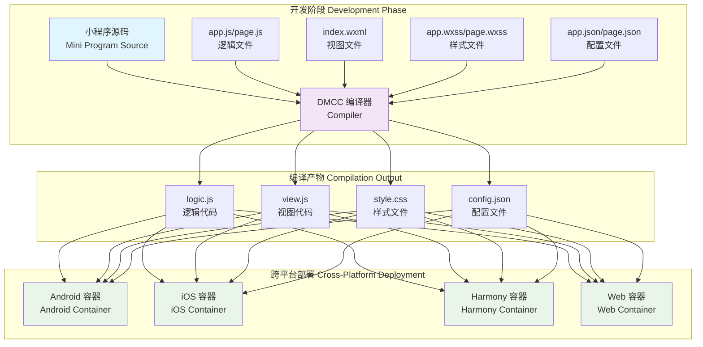
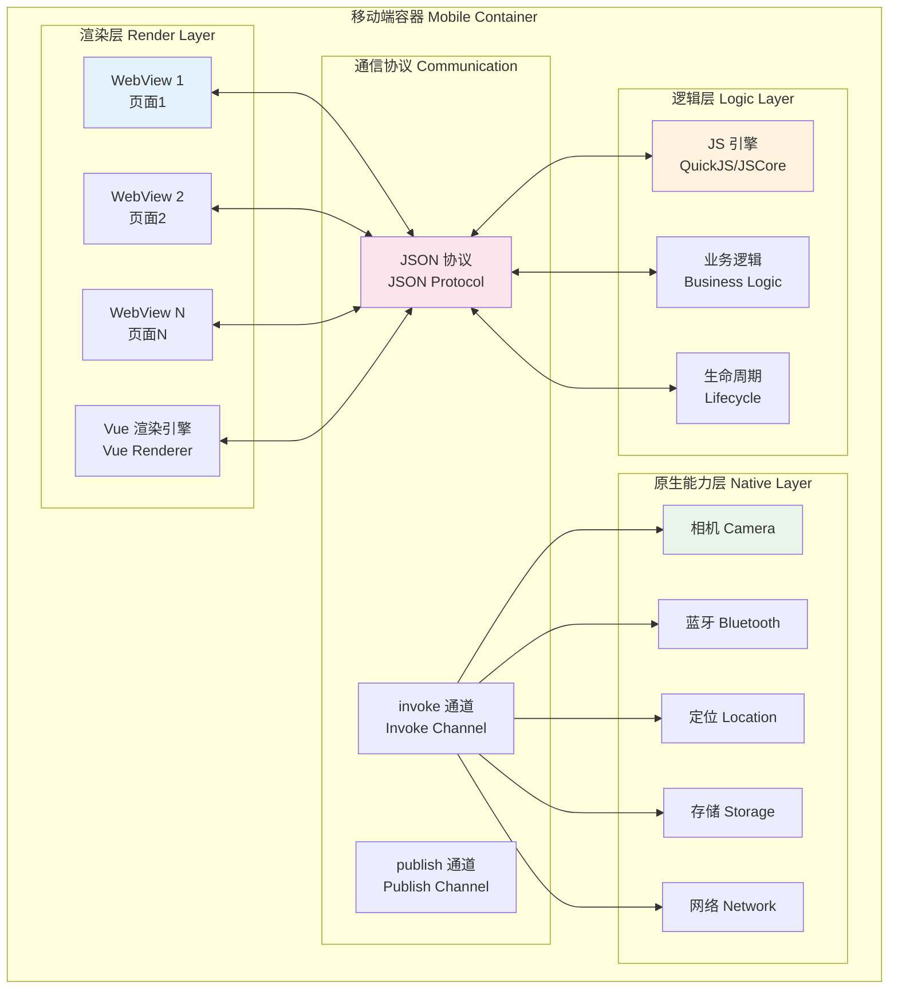
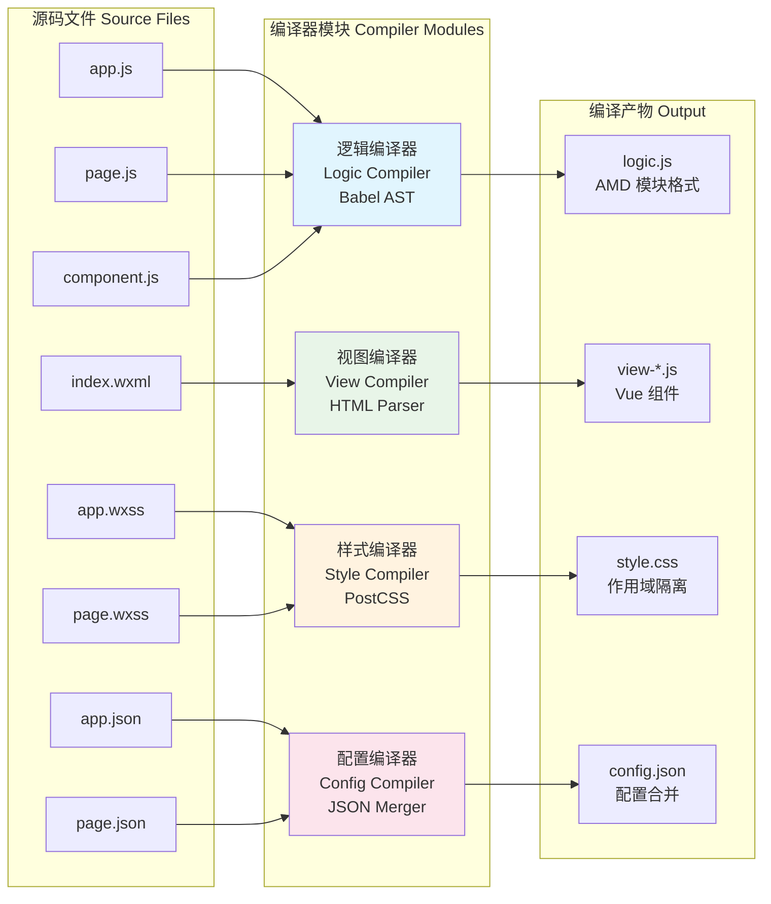
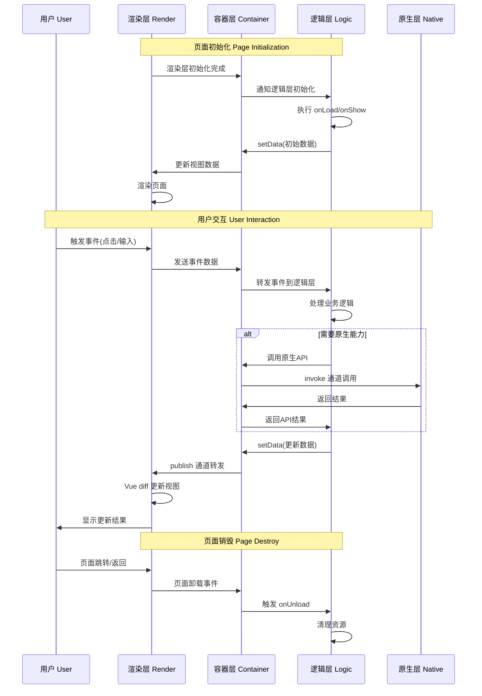
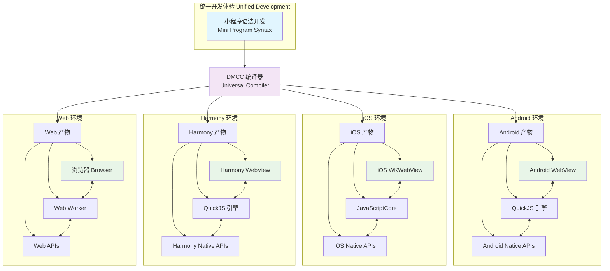

# Dimina 星河小程序架构图

## 整体架构流程图

```mermaid
graph TB
    subgraph "开发阶段 Development Phase"
        A[小程序源码<br/>Mini Program Source] --> B[DMCC 编译器<br/>Compiler]
        A1[app.js/page.js<br/>逻辑文件] --> B
        A2[index.wxml<br/>视图文件] --> B
        A3[app.wxss/page.wxss<br/>样式文件] --> B
        A4[app.json/page.json<br/>配置文件] --> B
    end

    subgraph "编译产物 Compilation Output"
        B --> C1[logic.js<br/>逻辑代码]
        B --> C2[view.js<br/>视图代码]
        B --> C3[style.css<br/>样式文件]
        B --> C4[config.json<br/>配置文件]
    end

    subgraph "跨平台部署 Cross-Platform Deployment"
        C1 --> D1[Android 容器<br/>Android Container]
        C2 --> D1
        C3 --> D1
        C4 --> D1
        
        C1 --> D2[iOS 容器<br/>iOS Container]
        C2 --> D2
        C3 --> D2
        C4 --> D2
        
        C1 --> D3[Harmony 容器<br/>Harmony Container]
        C2 --> D3
        C3 --> D3
        C4 --> D3
        
        C1 --> D4[Web 容器<br/>Web Container]
        C2 --> D4
        C3 --> D4
        C4 --> D4
    end

    style A fill:#e1f5fe
    style B fill:#f3e5f5
    style D1 fill:#e8f5e8
    style D2 fill:#e8f5e8
    style D3 fill:#e8f5e8
    style D4 fill:#e8f5e8
```

## 运行时架构图

```mermaid
graph TB
    subgraph "移动端容器 Mobile Container"
        subgraph "渲染层 Render Layer"
            R1[WebView 1<br/>页面1]
            R2[WebView 2<br/>页面2]
            R3[WebView N<br/>页面N]
            RV[Vue 渲染引擎<br/>Vue Renderer]
        end
        
        subgraph "逻辑层 Logic Layer"
            L1[JS 引擎<br/>QuickJS/JSCore]
            L2[业务逻辑<br/>Business Logic]
            L3[生命周期<br/>Lifecycle]
        end
        
        subgraph "原生能力层 Native Layer"
            N1[相机 Camera]
            N2[蓝牙 Bluetooth]
            N3[定位 Location]
            N4[存储 Storage]
            N5[网络 Network]
        end
        
        subgraph "通信协议 Communication"
            P1[JSON 协议<br/>JSON Protocol]
            P2[invoke 通道<br/>Invoke Channel]
            P3[publish 通道<br/>Publish Channel]
        end
    end

    R1 <--> P1
    R2 <--> P1
    R3 <--> P1
    RV <--> P1
    
    P1 <--> L1
    P1 <--> L2
    P1 <--> L3
    
    P2 --> N1
    P2 --> N2
    P2 --> N3
    P2 --> N4
    P2 --> N5

    style R1 fill:#e3f2fd
    style L1 fill:#fff3e0
    style N1 fill:#e8f5e8
    style P1 fill:#fce4ec
```

## 编译流程详细图

```mermaid
graph LR
    subgraph "源码文件 Source Files"
        S1[app.js]
        S2[page.js]
        S3[component.js]
        S4[index.wxml]
        S5[app.wxss]
        S6[page.wxss]
        S7[app.json]
        S8[page.json]
    end

    subgraph "编译器模块 Compiler Modules"
        C1[逻辑编译器<br/>Logic Compiler<br/>Babel AST]
        C2[视图编译器<br/>View Compiler<br/>HTML Parser]
        C3[样式编译器<br/>Style Compiler<br/>PostCSS]
        C4[配置编译器<br/>Config Compiler<br/>JSON Merger]
    end

    subgraph "编译产物 Output"
        O1[logic.js<br/>AMD 模块格式]
        O2[view-*.js<br/>Vue 组件]
        O3[style.css<br/>作用域隔离]
        O4[config.json<br/>配置合并]
    end

    S1 --> C1
    S2 --> C1
    S3 --> C1
    C1 --> O1

    S4 --> C2
    C2 --> O2

    S5 --> C3
    S6 --> C3
    C3 --> O3

    S7 --> C4
    S8 --> C4
    C4 --> O4

    style C1 fill:#e1f5fe
    style C2 fill:#e8f5e8
    style C3 fill:#fff3e0
    style C4 fill:#fce4ec
```

## 页面生命周期和交互时序图

```mermaid
sequenceDiagram
    participant U as 用户 User
    participant R as 渲染层 Render
    participant C as 容器层 Container
    participant L as 逻辑层 Logic
    participant N as 原生层 Native

    Note over R,L: 页面初始化 Page Initialization
    
    R->>C: 渲染层初始化完成
    C->>L: 通知逻辑层初始化
    L->>L: 执行 onLoad/onShow
    L->>C: setData(初始数据)
    C->>R: 更新视图数据
    R->>R: 渲染页面

    Note over U,N: 用户交互 User Interaction
    
    U->>R: 触发事件(点击/输入)
    R->>C: 发送事件数据
    C->>L: 转发事件到逻辑层
    L->>L: 处理业务逻辑
    
    alt 需要原生能力
        L->>C: 调用原生API
        C->>N: invoke 通道调用
        N->>C: 返回结果
        C->>L: 返回API结果
    end
    
    L->>C: setData(更新数据)
    C->>R: publish 通道转发
    R->>R: Vue diff 更新视图
    R->>U: 显示更新结果

    Note over R,L: 页面销毁 Page Destroy
    
    U->>R: 页面跳转/返回
    R->>C: 页面卸载事件
    C->>L: 触发 onUnload
    L->>L: 清理资源
```

## 跨平台架构对比图

```mermaid
graph TB
    subgraph "统一开发体验 Unified Development"
        DEV[小程序语法开发<br/>Mini Program Syntax]
    end

    DEV --> COMPILER[DMCC 编译器<br/>Universal Compiler]

    COMPILER --> AND_OUT[Android 产物]
    COMPILER --> IOS_OUT[iOS 产物]
    COMPILER --> HAR_OUT[Harmony 产物]
    COMPILER --> WEB_OUT[Web 产物]

    subgraph "Android 环境"
        AND_OUT --> AND_WEBVIEW[Android WebView]
        AND_OUT --> AND_JS[QuickJS 引擎]
        AND_OUT --> AND_API[Android Native APIs]
        AND_WEBVIEW <--> AND_JS
        AND_JS <--> AND_API
    end

    subgraph "iOS 环境"
        IOS_OUT --> IOS_WEBVIEW[iOS WKWebView]
        IOS_OUT --> IOS_JS[JavaScriptCore]
        IOS_OUT --> IOS_API[iOS Native APIs]
        IOS_WEBVIEW <--> IOS_JS
        IOS_JS <--> IOS_API
    end

    subgraph "Harmony 环境"
        HAR_OUT --> HAR_WEBVIEW[Harmony WebView]
        HAR_OUT --> HAR_JS[QuickJS 引擎]
        HAR_OUT --> HAR_API[Harmony Native APIs]
        HAR_WEBVIEW <--> HAR_JS
        HAR_JS <--> HAR_API
    end

    subgraph "Web 环境"
        WEB_OUT --> WEB_BROWSER[浏览器 Browser]
        WEB_OUT --> WEB_WORKER[Web Worker]
        WEB_OUT --> WEB_API[Web APIs]
        WEB_BROWSER <--> WEB_WORKER
        WEB_WORKER <--> WEB_API
    end

    style DEV fill:#e1f5fe
    style COMPILER fill:#f3e5f5
    style AND_WEBVIEW fill:#e8f5e8
    style IOS_WEBVIEW fill:#e8f5e8
    style HAR_WEBVIEW fill:#e8f5e8
    style WEB_BROWSER fill:#e8f5e8
```
