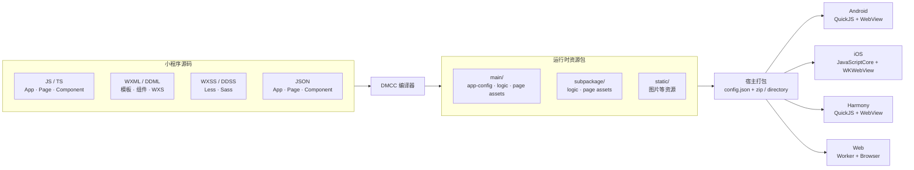
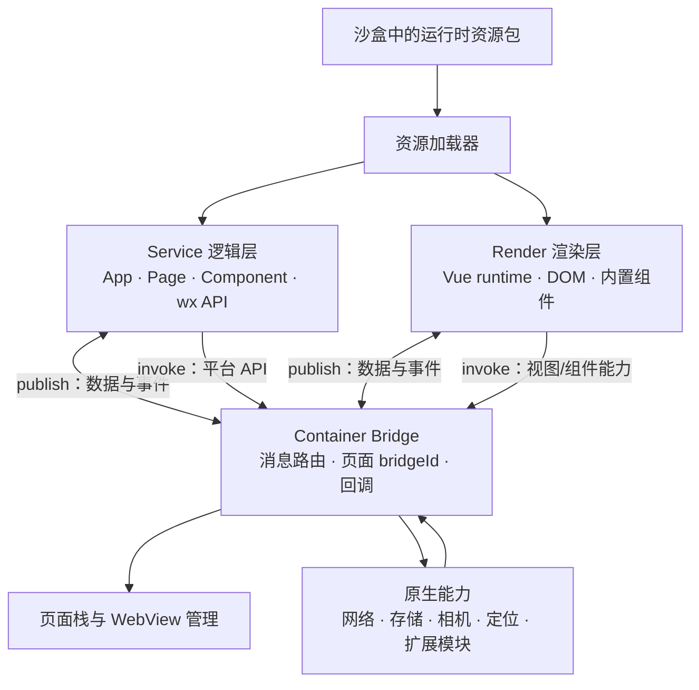
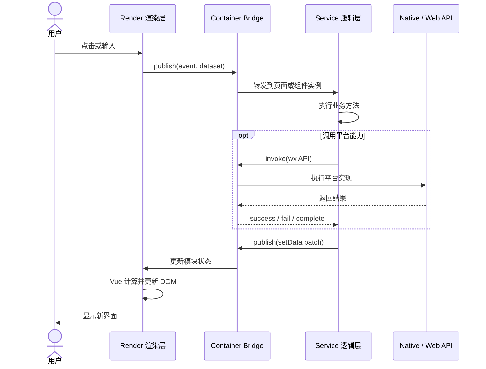
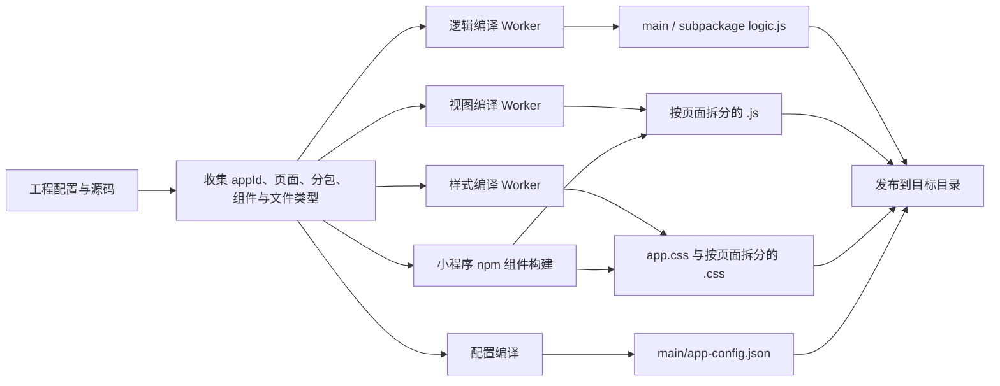

# Dimina 架构总览

[文档中心](./README.md) · [实现细节](./Architecture-Details.md) · [生命周期](./Architecture-Lifecycle.md) · [能力参考](./API-Reference.md)

Dimina 的核心链路是：DMCC 把小程序源码编译成平台无关的运行时资源包，再由各平台容器提供逻辑引擎、视图容器、页面栈和原生能力。

## 1. 从源码到四端容器

同一份 DMCC 产物由不同容器加载。平台差异集中在逻辑引擎、WebView、资源加载、页面栈和原生 API 实现，不需要为每个平台重新编译一套业务源码。图中的 Service、Render、Container 和 Native 表示运行时职责；它们不要求在每个平台上对应四个独立进程或物理模块。

## 2. 单个容器内部

逻辑层和渲染层不会直接调用彼此。容器负责所有跨层路由，因此一次业务操作可能跨越多个执行环境。

## 3. 一次用户交互的数据路径

`publish` 表示经容器转发的逻辑层/渲染层消息；`invoke` 表示调用容器或指定目标层的能力。具体实现见[通信与运行时分层](./Architecture-Details.md#3-两类消息通道)。

## 4. 编译器内部

逻辑、视图和样式任务可并行编译；主包和分包在输出阶段保持各自的运行时边界。详细的输入与文件命名规则见[源码与编译产物](./Architecture-Details.md#1-源码与编译产物)。

## 5. 平台运行时对照

| 平台 | Service 环境 | Render 环境 | 资源加载与页面 |
| --- | --- | --- | --- |
| Android | QuickJS | Android WebView | 沙盒资源映射、原生页面栈与 WebView 管理 |
| iOS | JavaScriptCore | WKWebView | 沙盒 Bundle、原生页面栈与 WKWebView 管理 |
| Harmony | QuickJS | Harmony WebView | 按版本目录加载、页面容器与 WebView 管理 |
| Web | Web Worker | Browser | HTTP/静态资源、浏览器页面容器 |

平台运行时共享 service 和 render 的核心语义，但原生 API 的覆盖范围可能不同。请以[能力参考](./API-Reference.md)和各端 SDK 文档为准。

## 6. 关键边界

- DMCC 产物是运行时资源，不是可以直接安装的原生应用包。
- `main/app-config.json` 描述小程序运行时模块；根 `config.json` 描述宿主加载所需的 App 与版本元数据。
- `setData()`、用户事件和生命周期跨越 service/render 边界，不能假设它们共享同一个事件循环。
- 容器提供 API 入口不代表四个平台的行为完全一致；跨端业务需要能力检测和降级策略。
- 远程包下载、校验和安装属于宿主更新链路，详见[小程序包更新](./MiniProgram-Update.md)。
