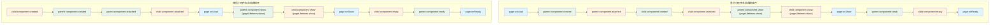

# 生命周期说明

星河小程序生命周期与微信有一定的时序差异，详情见下图。

## 生命周期流程图

```mermaid
graph TD
    subgraph "星河小程序生命周期顺序"
        B1["page onLoad"] --> B2["parent component created"]
        B2 --> B3["parent component attached"]
        B3 --> B4["child component created"]
        B4 --> B5["child component attached"]
        B5 --> B6["parent component show (pageLifetimes.show)"]
        B6 --> B7["child component show (pageLifetimes.show)"]
        B7 --> B8["page onShow"]
        B8 --> B9["parent component ready"]
        B9 --> B10["child component ready"]
        B10 --> B11["page onReady"]
    end
    
    subgraph "微信小程序生命周期顺序"
        A1["child component created"] --> A2["parent component created"]
        A2 --> A3["parent component attached"]
        A3 --> A4["child component attached"]
        A4 --> A5["page onLoad"]
        A5 --> A6["parent component show (pageLifetimes.show)"]
        A6 --> A7["child component show (pageLifetimes.show)"]
        A7 --> A8["page onShow"]
        A8 --> A9["child component ready"]
        A9 --> A10["parent component ready"]
        A10 --> A11["page onReady"]
    end
    
    %% 页面生命周期 - 浅蓝色
    style A5 fill:#e1f5fe
    style A8 fill:#e1f5fe
    style A11 fill:#e1f5fe
    style B1 fill:#e1f5fe
    style B8 fill:#e1f5fe
    style B11 fill:#e1f5fe
    
    %% Parent 组件生命周期 - 浅绿色
    style A2 fill:#e8f5e8
    style A3 fill:#e8f5e8
    style A6 fill:#e8f5e8
    style A10 fill:#e8f5e8
    style B2 fill:#e8f5e8
    style B4 fill:#e8f5e8
    style B6 fill:#e8f5e8
    style B9 fill:#e8f5e8
    
    %% Child 组件生命周期 - 浅橙色
    style A1 fill:#fff3e0
    style A4 fill:#fff3e0
    style A7 fill:#fff3e0
    style A9 fill:#fff3e0
    style B3 fill:#fff3e0
    style B5 fill:#fff3e0
    style B7 fill:#fff3e0
    style B10 fill:#fff3e0
```
