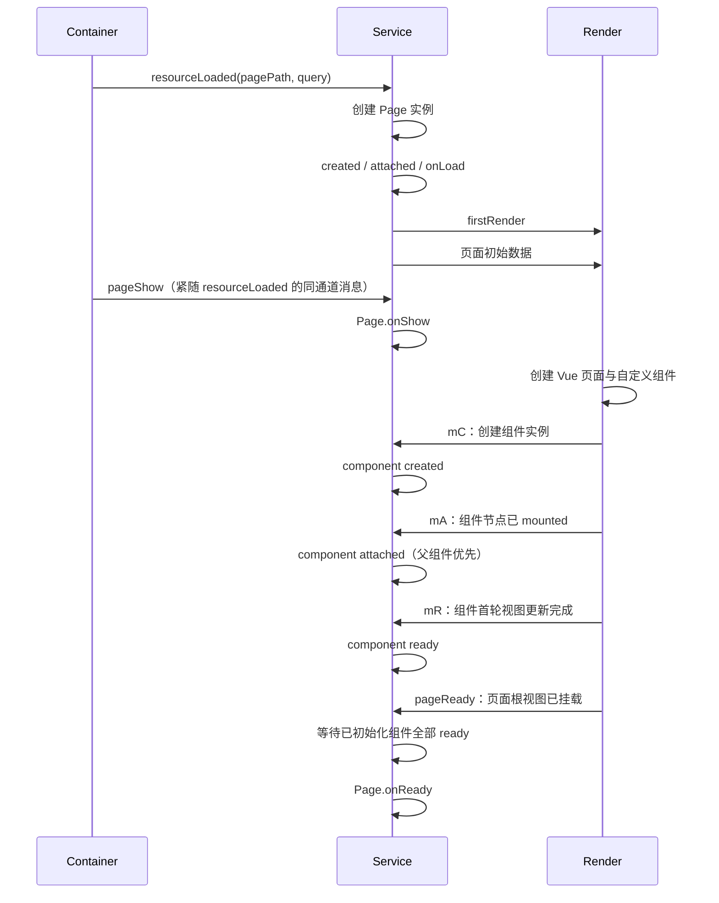
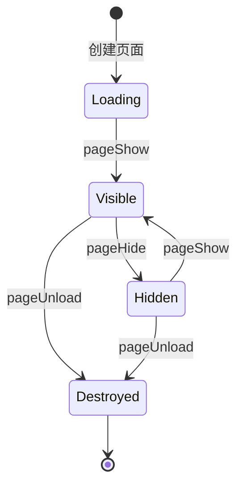

# 生命周期与就绪时序

[文档中心](./README.md) · [架构图](./Architecture-Diagram.md) · [实现细节](./Architecture-Details.md)

Dimina 的生命周期跨越 service、render 和 container 三个执行环境。本文记录当前实现中对业务最重要的顺序与就绪边界；父子组件或同级组件之间没有在本文声明的顺序，不应作为业务依赖。

## 1. App 生命周期

| 场景 | 调用 |
| --- | --- |
| 冷启动并创建 App 实例 | `App.onLaunch(options)` → `App.onShow(options)` |
| 宿主切到前台 | `App.onShow(options)` |
| 宿主切到后台 | `App.onHide()` |

App 实例在同一小程序逻辑运行时中只创建一次。页面切换不会重新触发 `onLaunch`；只有逻辑运行时被销毁并重建后才会再次创建 App。

## 2. 首次打开页面

`pageShow` 由容器的真实页面可见状态驱动。Web 与 Android 容器会在双线程资源未就绪时缓存最新可见状态，先发送 `resourceLoaded`，再通过同一 service 通道发送 `pageShow` 或 `pageHide`；iOS 与 Harmony 的真实早到事件则由 service 暂存。每次 Web / Android `start` 都会生成独立的 `resourceLoadId`，service 和 render 回传同一标识，容器会丢弃已销毁或前一次加载的延迟确认。service 不再根据“页面已创建且未隐藏”自行猜测首次显示，只消费容器信号并对重复事件去重。即使 render 的 `pageReady` 先到，service 也会等到页面实际显示后再触发 `onReady`，保证 `onLoad` → `onShow` → `onReady`。因此可以依赖以下稳定边界：

- `onLoad`：页面实例已创建，可以读取路由参数、初始化状态并调用 `setData()`；此时不能假设 DOM 已存在。
- `onShow`：页面已经进入前台，但不保证第一次渲染完成。
- 组件 `ready`：该组件的 render 实例已挂载。
- `onReady`：页面根视图已挂载，并且当前已初始化的自定义组件都已执行 `ready`。

## 3. 页面与组件顺序

当前页面初始化分为两个阶段：

1. service 先创建 Page 实例，依次完成页面的 `created`、`attached` 和 `onLoad`，再把初始数据交给 render。
2. render 根据页面模板创建自定义组件；先注册该组件的初始数据监听，再通过 `mC` 请求 service 建立实例并执行 `created`。render 节点 mounted 后通过 `mA` 触发 `attached`，首轮视图更新完成后通过 `mR` 触发 `ready`。“先监听、后请求”保证 service 同步返回时不会丢失初始数据。

页面 `onReady` 使用就绪屏障：render 报告页面根节点挂载完成后，service 仍会等待已初始化组件全部 `ready`，再调用页面 `onReady`。这样可以避免页面测量早于组件真实挂载。

父子组件同时进入节点树时，`attached` 按父组件到子组件的顺序执行；尚未 attached 的子组件会等待父组件。组件的 `pageLifetimes` 按真实组件树深度优先、父先于子的顺序传播，不使用仅按层级深度的排序；销毁时则先子后父执行 `detached`，`detached` 回调结束后再触发 relation `unlinked`。`ready` 由各自的视图完成信号驱动，页面 `onReady` 则统一等待当前已初始化组件。

service 内的 `created`、初始 property observer、`attached` 和 `onLoad` 在当前生命周期消息的同一调用栈内执行。生命周期函数返回 Promise 不会延迟后续生命周期或实例初始化；同一阶段的每个生命周期、observer、relation 和 `setData` 回调独立隔离异常，某个回调抛错不会截断剩余回调或组件树遍历，组件错误会传给 `error` 生命周期。需要异步更新数据时，应在异步任务完成后显式调用 `setData()`，不能依赖 `async onLoad()` 或 `async attached()` 的返回值控制框架顺序。页面首屏数据仍由 service 明确安排在 `firstRender` 消息之后发送，这是跨线程协议顺序，而不是生命周期 Promise 或微任务边界。

## 4. `setData()` 的时机

| 调用位置 | 行为 |
| --- | --- |
| `onLoad` / 初始化生命周期 | 数据先写入 service 状态；视图模块就绪后再同步到 render |
| 页面已就绪 | 更新进入队列，经 container 转发到 render |
| 带回调的初始化更新 | 回调会暂存，等对应模块就绪并完成更新后执行 |

`setData()` 表示发起一次跨线程状态更新，不代表下一行代码执行时 DOM 已更新。需要读取布局时，应使用 `setData(data, callback)`、`onReady`，或选择器 API 的回调结果，而不是固定延时。

路径解析与数据传递采用小程序语义：方括号只接受数字下标，点号和方括号可通过反斜杠转义为字段名；逻辑层在调用时深拷贝引用值，传给 render 的数据则在入队时生成 JSON 快照。调用后继续修改原对象不会污染逻辑数据或待发送的视图更新。

## 5. 显示、隐藏与销毁

| 容器事件 | 页面回调 | 组件回调 |
| --- | --- | --- |
| `pageShow` | `Page.onShow` | `pageLifetimes.show` |
| `pageHide` | `Page.onHide` | `pageLifetimes.hide` |
| `pageUnload` | `Page.onUnload` | `detached`，并清理实例记录 |

页面从后台返回前台时会再次触发 `onShow`，但不会再次触发 `onLoad` 或 `onReady`。重新创建页面实例后，才会重新经历完整初始化流程。

## 6. 编写与排查建议

- 在 `onLoad` 中处理路由参数、请求和初始状态；在 `onReady` 中处理首次 DOM 测量或依赖组件布局的逻辑。
- 不要用 `setTimeout`、连续 `nextTick` 或固定 animation frame 模拟跨 service/render 的就绪信号。
- 排查时分别记录 container、service 和 render 的事件，并携带 `bridgeId`、`moduleId`、页面路径和消息类型。
- 至少验证首次进入、返回后再次显示、销毁后重进、快速切换以及条件组件出现/消失等路径。
- 生命周期兼容目标以微信小程序语义为基准，但具体支持范围仍应结合当前实现和测试确认。

有关消息通道与页面容器的说明，继续阅读[实现细节](./Architecture-Details.md#3-两类消息通道)。
