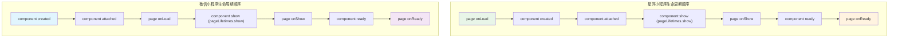

# 生命周期说明

星河小程序生命周期与微信有一定的时序差异，详情见下图。

## 生命周期流程图

```mermaid
graph TD
    subgraph "星河小程序生命周期顺序"
        B1["page onLoad"] --> B2["component created"]
        B2 --> B3["component attached"]
        B3 --> B4["component show (pageLifetimes.show)"]
        B4 --> B5["page onShow"]
        B5 --> B6["component ready"]
        B6 --> B7["page onReady"]
    end
    
    subgraph "微信小程序生命周期顺序"
        A1["component created"] --> A2["component attached"]
        A2 --> A3["page onLoad"]
        A3 --> A4["component show (pageLifetimes.show)"]
        A4 --> A5["page onShow"] 
        A5 --> A6["component ready"]
        A6 --> A7["page onReady"]
    end
    
    style A1 fill:#e1f5fe
    style A7 fill:#f3e5f5
    style B1 fill:#e8f5e8
    style B7 fill:#fff3e0
```
