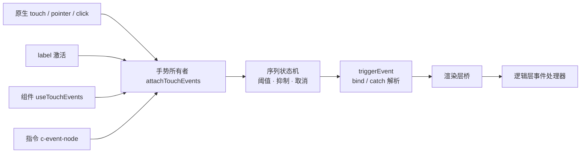

# 触摸事件与手势

[文档中心](./README.md) · [架构总览](./Architecture-Diagram.md) · [能力参考](./API-Reference.md)

Dimina 的手势事件由渲染层合成：组件在自己的根元素上安装一套触摸状态机，把原生 `touchstart` / `touchmove` / `touchend` / `touchcancel` 与指针序列翻译成小程序的 `tap`、`longpress`、`longtap`、`canceltap`，再经渲染层桥发往逻辑层。四端共用这一份实现，因为渲染层在 Android、iOS、HarmonyOS 和 Web 都运行在浏览器环境里。

本文以微信小程序当前的 [WXML 事件](https://developers.weixin.qq.com/miniprogram/dev/framework/view/wxml/event.html) 与 [`label`](https://developers.weixin.qq.com/miniprogram/dev/component/label.html) 文档为公开契约基准。文档未定义的部分（多指下每个触点的 `tap` 判定、label 对隐藏与禁用控件的处理、容器事件的归属）以微信开发者工具上的可复现行为为准，并在第 7 节集中列出。

## 1. 支持范围

### 1.1 手势事件

| 事件 | 触发条件 | 说明 |
| --- | --- | --- |
| `touchstart` | 手指或指针按下 | 原样转发原生序列的起点 |
| `touchmove` | 触点移动 | 位移是否超阈值不影响本事件 |
| `touchend` | 触点抬起 | 先于 `tap` 派发 |
| `touchcancel` | 序列被系统或页面中断 | 指针序列在窗口失焦时也走这里 |
| `tap` | 单指按下并抬起，期间未超过位移阈值、未被长按抑制 | 由触摸序列合成，不来自原生 `click` |
| `longtap` | 单指按住超过阈值 | 不抑制随后的 `tap`，属弃用兼容行为 |
| `longpress` | 单指按住超过阈值 | 节点绑定了 `longpress` 时抑制本次 `tap` |
| `canceltap` | 位移超过阈值，或抬手时已远离起点，或序列被取消 | 取消后的每条 `touchmove` 各一条；抬手复查与 `touchcancel` 只在还没发过时补一条 |

### 1.2 绑定写法

| 写法 | 冒泡 | 是否实现 |
| --- | --- | --- |
| `bindtap`、`bind:tap` | 继续向上派发 | 是 |
| `catchtap`、`catch:tap` | 阻断同类事件继续向上派发 | 是 |
| `mut-bind:tap` | 互斥绑定 | 否，编译器识别该前缀但渲染层不派发 |
| `capture-bind:tap`、`capture-catch:tap` | 捕获阶段 | 否，编译器识别该前缀但渲染层不派发 |

`catch` 只阻止事件冒泡，不改变浏览器的默认行为。

### 1.3 安装手势的节点

组件路径：`button`、`canvas`、`checkbox`、`image`、`label`、`movable-area`、`navigator`、`picker`、`radio`、`slider`、`switch`、`text`、`view` 共 13 个内置组件在根元素上安装。

指令路径：编译产物中保持为原生元素的 `canvas` 节点由 `c-event-node` 指令安装，与组件路径调用同一个 `attachTouchEvents`。

一个元素只允许存在一个手势所有者。组件能取得插槽嵌套节点和相对坐标等上下文，因此可以从已安装的指令手中接管；指令不会反向抢回已经由组件接管的元素。归属不能按安装顺序决定，因为 Vue 的指令 `mounted` 早于同一实例的 `onMounted`。

## 2. 事件数据

发往逻辑层的事件对象字段：

| 字段 | 说明 |
| --- | --- |
| `type` | 事件类型 |
| `timeStamp` | 页面打开到事件触发经过的毫秒数 |
| `target` | 触发事件的节点的 `id`、`dataset`、`offsetLeft`、`offsetTop`（官方只定义 `id` 与 `dataset`） |
| `currentTarget` | `bind` / `catch` 绑定所在节点的同名字段 |
| `touches` | 当前屏幕上的所有触摸点 |
| `changedTouches` | 本次事件涉及的触摸点 |
| `detail` | 带坐标的手势事件（`tap`、`longpress`、`longtap`、`canceltap`）统一带 `x`、`y`，取 `pageX` / `pageY`；组件事件的 `detail` 由各组件按自身语义填充 |

触摸点字段为 `identifier`、`clientX`、`clientY`、`pageX`、`pageY`、`screenX`、`screenY`、`force`。`canvas` 的触摸点额外带 `x`、`y`，即相对小程序声明的 canvas 根节点 border box 左上角的坐标，对应官方的 `CanvasTouch`；内部 backing canvas 位于边框内侧，不能用它作为坐标原点。

`tap` 使用序列起点的触摸点，`touchmove` 与 `touchend` 使用各自时刻的触摸点。

## 3. 手势规则

### 3.1 判定阈值

| 参数 | 默认值 | 作用 |
| --- | --- | --- |
| 长按阈值 | 350ms | 触发 `longtap` 与 `longpress` |
| 位移阈值 | 10px | 任一轴超过即判定为移动 |

### 3.2 一次触摸序列

- `tap` 由触摸序列合成，不监听原生 `click`。`canvas` 这类只有触摸通道的节点因此同样能拿到 `tap`，长按也才能按官方语义抑制本次 `tap`。
- 位移超过阈值后本次序列不再产生 `tap`，并从越过阈值的那一次 `touchmove` 起，之后每一条 `touchmove` 都各带一条 `canceltap`：同一个探针小程序在微信开发者工具上跑，两次越过阈值的移动记到两条 `canceltap`。`touchend` 终点复查与 `touchcancel` 这两条路径只在整段序列还没发过 `canceltap` 时补一条。
- `touchend` 上按起点与终点再判一次距离：`touchmove` 可能一条都没到（被 `preventDefault` 吞掉，或系统把移动并进抬手），此时超过位移阈值改发 `canceltap`，不合成 `tap`。
- `longpress` 触发后抑制本次 `tap`；抑制标记记录在原生事件上，祖先节点观察到同一次序列时也不再合成自己的 `tap`。`longtap` 不抑制。
- `tap`、`longpress` 与 `longtap` 是单指手势。第二根手指加入时只取消长按计时器，本次序列不再触发 `longpress` 与 `longtap`；它不重置起点，也不影响第一根手指的 `tap` 判定。第一根手指原地抬起仍会产生一次 `tap`。多指下每个触点的终态见第 7 节。
- 鼠标与触控笔经 `pointerdown` 合成 `identifier` 为 `0` 的单点触摸序列，与官方基础库在 PC 上的做法一致。移动与抬起监听在 `document` 上，指针移出节点后抬起仍能收口；窗口失焦按取消处理。
- 原生 `click` 只作为兜底，覆盖程序化 `element.click()` 与键盘、无障碍触发。指针序列补发的 `click` 带非零 `detail`，此时 `tap` 已由触摸序列合成，一律放过。
- `tap` 在 `touchend` 完整冒泡结束后的同一个微任务里统一派发。路径上每个所有者先登记任务再统一收口，因此处理器中同步移除 DOM 或 `document` 级的 `pointerup` 都不会让某个节点提前结束或漏发。

### 3.3 传播与原生滚动

- `catch` 只管理小程序事件的传播。所有事件都按类型在原生事件上打标记，只抑制祖先派发同一类型，不阻断原生冒泡：祖先仍能观察完整原生序列来推进自己的状态机，后代的 `catch:tap` 也不会顺带吃掉祖先的 `bindtouchend`。
- 监听器的 `passive` 由该节点是否存在对应 `catch` 决定，`touchmove` 还叠加 `disable-scroll`；`bind` 与 `catch` 动态切换时精确重装监听器。
- 是否阻止原生滚动与小程序事件传播分开裁决：存在 `catchtouchmove` 时，沿 `composedPath` 走到 catch 边界为止，若路径上存在该方向仍可滚动的容器则放行，否则阻止默认行为；`canvas` 的 `disable-scroll` 无条件阻止，不参与该裁决。滚动是否被阻止不影响位移、长按与 `canceltap` 的状态推进。

## 4. label 激活

`label` 的激活是一次定向调用，不是模拟点击。控件执行自己的动作，但不会因此获得一次自己的 `tap`，也不波及控件的祖先。

- 可激活的控件只有 `button`、`checkbox`、`input`、`radio`、`switch` 五种。`textarea` 和 `slider` 不在其内：查找会跳过它们，点在它们身上也不算“点在控件上”。
- `for` 优先于内部控件；`for` 指向不存在的 id 时不回退到内部控件。
- 内部有多个控件时取文档序第一个，隐藏的控件同样计入，禁用的控件也不跳过。
- 守卫只看被点节点到 `label` 之间这一段：这段里存在可激活控件时不激活。`label` 外层套着的可激活控件不参与判断，因此 `button` 包 `label` 不会抑制内部控件的激活。
- 勾选类控件被激活时执行自身动作，不补发 `tap`：`switch` 派发自己的 `change`，`checkbox` 与 `radio` 触发所在 group 的 `change`（归属见第 5 节），不在 group 内时只改自己的状态。`button` 被激活时会补发一次自己的 `tap` 且该 `tap` 沿组件树冒泡，祖先各多收到一次；补发通过一个冒泡的自定义事件交给路径上的手势所有者，与真实序列合成的 `tap` 一样受 `catch` 约束。禁用的 `button` 不开启这条通道。
- 目标是真实 `input` 时激活即聚焦；`label` 在 `click` 阶段一律取消原生 `<label>` 的默认转发，避免同一次点击既走定向激活又走浏览器转发。
- 激活挂在 `tap` 之前。长按或拖走使 `tap` 不成立时，激活同样不发生。

## 5. 容器事件的归属

事件的 `id` 与 `dataset` 取自 `currentTarget`，而 `currentTarget` 按定义是绑定处理器的那个节点。以下容器用子项的那次事件派发自己的事件，因此显式给出自己的根元素，而不是沿用子项的 `currentTarget`：

| 容器 | 事件 | 触发者 |
| --- | --- | --- |
| `radio-group` | `change` | 组内 `radio` |
| `checkbox-group` | `change` | 组内 `checkbox` |
| `form` | `submit`、`reset` | `form-type` 按钮 |
| `picker-view` | `change` | `picker-view-column` |

`form-type` 按钮先派发自己的 `tap`，`submit` / `reset` 是其后的另一件事。`picker-view` 的 `change` 属于用户那次滚动选择：以“有没有待结算的拖动”为准结算，页面改写 `value` 引起的滚动不产生 `change`。

## 6. 架构

| 层 | 职责 |
| --- | --- |
| `useTouchEvents` | 组件薄壳，把安装与卸载绑到组件生命周期，并按 `catch` 变化重装 |
| `c-event-node` | 指令兜底，为编译产物中保持原生元素的 `canvas` 安装同一套手势 |
| `attachTouchEvents` | 手势语义的唯一实现：序列状态机、抑制规则、传播标记、滚动裁决 |
| `touchGesturePrimitives` | 触摸点整理、序列共享状态、微任务收口、滚动可行性判断、激活 tap 事件 |
| `labelActivation` | 控件激活入口的登记与调用，以及可激活控件集合 |
| `events` | `bind` / `catch` 解析、事件对象组装与发往逻辑层 |

节点卸载时若原生序列仍在进行，所有者延迟到真实的 `touchend` / `touchcancel` 再摘除，不伪造终态。但卸载会立刻停掉长按计时器：`longpress` 与 `longtap` 由所有者自己的时钟合成，节点已经离开树之后不该再补造。`bind` / `catch` 变化引起的换 owner 走同一条延迟摘除路径，节点仍在树上，长按照常触发。

Android 另有一条独立路径：原生组件占位节点的触摸在 `document` 捕获阶段透传给原生层，不参与本文的手势合成。

## 7. 与微信公开契约的差异及限制

- 捕获阶段绑定 `capture-bind` / `capture-catch` 与互斥绑定 `mut-bind` 未实现；编译器识别这些前缀，渲染层不派发。
- 一个手势所有者只维护一条触摸序列，`tap` 与 `canceltap` 属于这条序列而不是逐个触点。多指同时按下时，只有建立序列的那根手指会产生终态事件，其余触点只透传原生 `touchstart` / `touchmove` / `touchend`。glass-easel 按 `identifier` 逐触点记 `possibleTaps`，每个触点各有自己的终态；微信公开文档未定义多指下的 `tap` 时机，Dimina 不采用该模型。
- `label` 对隐藏控件与禁用控件的处理（都不跳过）由实测确定，微信文档未定义。
- 容器事件的归属（`change` 记在容器还是子项）由微信实测行为确定，官方文档未定义。
- 原生焦点只跟随受信任手势，因此自动化工具注入的合成事件无法驱动 `input` 聚焦；该差异属于浏览器约束，不属于手势语义。

## 8. 源码入口

| 范围 | 文件 |
| --- | --- |
| 手势状态机 | `fe/packages/components/src/common/touchGestures.js` |
| 手势原语 | `fe/packages/components/src/common/touchGesturePrimitives.js` |
| 组件安装薄壳 | `fe/packages/components/src/common/useTouchEvents.js` |
| 指令安装路径 | `fe/packages/components/index.js` |
| label 激活 | `fe/packages/components/src/common/labelActivation.js` |
| 事件解析与上行 | `fe/packages/components/src/common/events.js` |
| Android 原生占位透传 | `fe/packages/components/src/common/nativeLayerTouchBridge.js` |

完整组件与能力支持状态见[能力参考](./API-Reference.md)。
