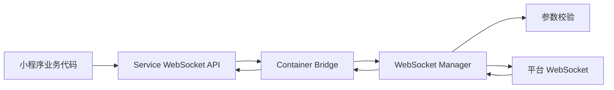

# WebSocket 能力

[文档中心](./README.md) · [架构总览](./Architecture-Diagram.md) · [能力参考](./API-Reference.md)

Dimina 在 Android、iOS、HarmonyOS 和 Web 提供微信小程序 WebSocket API。连接由 service 逻辑层调用，经容器桥接到平台 WebSocket 实现。

本文以微信小程序当前的 [`wx.connectSocket`](https://developers.weixin.qq.com/miniprogram/dev/api/network/websocket/wx.connectSocket.html)、[`SocketTask`](https://developers.weixin.qq.com/miniprogram/dev/api/network/websocket/SocketTask.html)、[网络使用说明](https://developers.weixin.qq.com/miniprogram/dev/framework/ability/network.html)、[`app.json` 的 `networkTimeout`](https://developers.weixin.qq.com/miniprogram/dev/reference/configuration/app.html#networkTimeout) 和官方 [`wechat-miniprogram/api-typings`](https://github.com/wechat-miniprogram/api-typings) 5.2.3 为公开契约基准。官方未定义的多连接路由、监听覆盖和错误文案不作为微信公开契约；需要确定性处理的部分明确标为 Dimina 行为。

## 1. 支持范围

### 1.1 `wx` API

| API | 说明 | 返回值 |
| --- | --- | --- |
| `wx.connectSocket(options)` | 创建连接并返回任务对象 | `SocketTask`；脚本层前置校验失败时为 `undefined` |
| `wx.sendSocketMessage(options)` | 通过全局绑定连接发送数据 | 回调形式为 `void`，无回调字段时为 `Promise` |
| `wx.closeSocket(options)` | 关闭已打开的全局绑定连接 | 回调形式为 `void`，无回调字段时为 `Promise` |
| `wx.onSocketOpen(callback)` | 监听全局绑定连接打开 | `void` |
| `wx.onSocketMessage(callback)` | 监听全局绑定连接消息 | `void` |
| `wx.onSocketError(callback)` | 监听全局绑定连接错误 | `void` |
| `wx.onSocketClose(callback)` | 监听全局绑定连接关闭 | `void` |

### 1.2 `wx.connectSocket(options)`

| 属性 | 类型 | 必填 | 说明 |
| --- | --- | --- | --- |
| `url` | `string` | 是 | `wss://` 地址 |
| `header` | `object` | 否 | 握手请求头，不能设置 `Referer` |
| `protocols` | `string[]` | 否 | WebSocket 子协议列表 |
| `tcpNoDelay` | `boolean` | 否 | 建立连接时设置 TCP_NODELAY |
| `perMessageDeflate` | `boolean` | 否 | 是否开启压缩扩展 |
| `timeout` | `number` | 否 | 连接超时，单位毫秒 |
| `forceCellularNetwork` | `boolean` | 否 | 强制使用蜂窝网络 |
| `success` | `function` | 否 | 参数通过容器校验并安排连接后调用，不表示握手完成 |
| `fail` | `function` | 否 | 参数或连接请求失败时调用 |
| `complete` | `function` | 否 | 调用结束时调用，参数与 `success` 或 `fail` 相同 |

连接结果以 `SocketTask.onOpen`、`SocketTask.onError` 和 `SocketTask.onClose` 为准。官方文档明确 `connectSocket` 不支持 Promise 风格。参数通过公开校验时返回 `SocketTask`；脚本层必填参数或 `wss` 协议校验失败时返回 `undefined`。超过连接上限时仍返回已封存的 `SocketTask` 并调用 `fail`。

### 1.3 `SocketTask` 方法

微信官方文档和类型定义为 `SocketTask` 声明以下 6 个方法，且 `send`、`close` 均不支持 Promise 风格。

| 方法 | 参数 | 说明 | 返回值 |
| --- | --- | --- | --- |
| `send(options)` | `data`、`success`、`fail`、`complete` | 发送字符串或 `ArrayBuffer`；连接打开后才能发送 | `void` |
| `close(options)` | `code`、`reason`、`success`、`fail`、`complete` | 关闭当前任务对应的连接 | `void` |
| `onOpen(callback)` | `callback` | 监听连接打开 | `void` |
| `onMessage(callback)` | `callback` | 监听消息 | `void` |
| `onError(callback)` | `callback` | 监听错误 | `void` |
| `onClose(callback)` | `callback` | 监听关闭 | `void` |

微信未公开定义重复注册任务监听的覆盖与去重规则。Dimina 当前允许多个不同函数按注册顺序调用，同一函数对象重复注册会去重。官方未提供 `SocketTask.offOpen`、`offMessage`、`offError` 和 `offClose`；Dimina 同样不暴露这些方法，监听随连接终止或小程序销毁统一释放。

`send(options)` 的 `data` 只接受 `string` 或 `ArrayBuffer`。`TypedArray`、`DataView` 和 `SharedArrayBuffer` 不会转换为二进制帧。

`close(options)` 的参数如下：

| 属性 | 类型 | 默认值 | 约束 |
| --- | --- | --- | --- |
| `code` | `number` | `1000` | 仅接受 `1000` 或 `3000`～`4999` 的整数 |
| `reason` | `string` | `''` | UTF-8 编码后不超过 123 字节 |
| `success` / `fail` / `complete` | `function` | — | 调用结果回调 |

微信文档明确规定 `reason` 不超过 123 个 UTF-8 字节，但只把 `code` 描述为数字；`1000` 或 `3000`～`4999` 的范围来自微信运行时与平台 WebSocket 出站关闭码约束。

### 1.4 全局发送与关闭

`wx.sendSocketMessage(options)` 支持 `data`、`success`、`fail`、`complete`。`wx.closeSocket(options)` 支持 `code`、`reason`、`success`、`fail`、`complete`，字段约束与 `SocketTask` 对应方法一致。

参数对象包含任意一个 `success`、`fail` 或 `complete` 自有属性时，接口使用回调形式并返回 `void`；三个属性均不存在时返回 `Promise`。属性值不是函数时不会作为桥回调 ID 下发。

## 2. 事件数据

| 事件 | `SocketTask` 回调参数 | 全局回调参数 |
| --- | --- | --- |
| `open` | `{ header, profile? }` | `{ header }` |
| `message` | `{ data }` | `{ data }` |
| `error` | `{ errMsg }` | `{ errMsg }` |
| `close` | `{ code, reason }` | `{ code, reason }` |

文本帧的 `data` 为字符串，二进制帧的 `data` 为 `ArrayBuffer`。桥接层使用 Base64 传输二进制数据，`isBuffer` 等内部字段不会暴露给业务代码。

`profile` 包含以下数值属性，单位为毫秒：

| 属性 | 说明 |
| --- | --- |
| `fetchStart` | 开始处理连接的时间戳 |
| `domainLookUpStart` / `domainLookUpEnd` | DNS 查询起止时间 |
| `connectStart` / `connectEnd` | 连接阶段起止时间 |
| `rtt` | 连接阶段耗时 |
| `handshakeCost` | WebSocket 握手耗时 |
| `cost` | 从开始处理到连接打开的总耗时 |

`profile` 仅可能出现在任务态 `open`，包含上述 8 个字段；全局 `wx.onSocketOpen` 的结果只有 `header`。

## 3. 参数与连接规则

### 3.1 地址、超时与请求头

- `url` 只接受 `wss`，必须包含有效主机，且不能包含 fragment、非法字符或残缺百分号编码。
- 连接超时依次取调用参数、`app.json` 的 `networkTimeout.connectSocket` 和默认值 60000 毫秒；有效范围为 1～2147483647 毫秒。
- 请求头值在 service 层转换为字符串；非法请求头会被拒绝，受限请求头会被过滤。
- `protocols` 由平台 WebSocket API 设置，不通过自定义请求头传递。

### 3.2 连接和全局绑定

每个小程序最多同时存在 5 条未终态连接。握手中、已打开和关闭握手中的连接都占用名额，连接收到 `close` / `error` 或前置连接失败后归还名额。

微信仅提示多连接下使用全局 API 可能出现不符合预期的行为，没有公开绑定算法。Dimina 当前将全局 API 确定性路由到最早创建且尚未终态的连接；绑定只在后续 `wx.connectSocket` 时更新。需要管理多条连接时应使用 `SocketTask`。

`wx.closeSocket` 只处理已经打开的全局绑定连接。绑定目标尚在握手、正在关闭或已经终态时调用失败；其他 `SocketTask` 不受影响。`SocketTask.close` 只处理当前任务对应的连接。

### 3.3 生命周期

| 场景 | 行为 |
| --- | --- |
| 进入后台 | 启动 5 秒宽限计时 |
| 宽限期内返回前台 | 取消后台清理 |
| 后台调用连接、发送或关闭 API | 返回 `interrupted` |
| 宽限到期且仍在握手 | 终止连接并触发 `error` |
| 宽限到期且已打开 | 终止连接并触发 `{ code: 1006, reason: "interrupted" }` 的 `close` |
| 宿主启用空闲超时 | 成功发送或收到消息时重新计时 |
| 小程序销毁 | 静默关闭连接并清理定时器、监听和事件补发记录 |

连接打开、消息、错误、关闭和定时器操作在各平台的串行执行环境内更新。平台事件早于 service 内部桥监听登记时，`open`、`error` 和 `close` 支持一次补发，`message` 不补发，终态记录每个小程序最多保留 32 条；事件已经派发到 service 后才由业务代码新增的 `SocketTask.on*` 监听不会收到历史事件。

## 4. 架构

Native Manager 为进程级单例并按 `appId` 隔离状态；Web Manager 随 `MiniApp` 实例创建。各端分别管理连接、全局绑定、监听、后台状态和终态记录，每条连接都由内部 `socketId` 定位。

| 层 | Android | iOS | HarmonyOS | Web |
| --- | --- | --- | --- | --- |
| 桥接入口 | `WebSocketApi` | `WebSocketAPI` | `DMPContainerBridgesModuleWebSocket` | `MiniApp` WebSocket API |
| 管理器 | `WebSocketManager` | `DMPWebSocketManager` | `DMPWebSocketManager` | `WebSocketManager` |
| 参数校验 | `WebSocketValidation` | `DMPWebSocketValidation` | `DMPWebSocketManager` 内部校验 | `WebSocketValidation` |
| 传输 | OkHttp WebSocket | `URLSessionWebSocketTask` | `@ohos.net.webSocket` | 浏览器 `WebSocket` |
| 串行环境 | `SerialExecutor` | `DispatchQueue` | JavaScript 事件循环 | JavaScript 事件循环 |

## 5. 与微信公开契约的差异及平台限制

- 尚未执行微信生产环境的服务器合法域名白名单；系统证书校验不能替代后台域名配置策略。
- `forceCellularNetwork` 四端未生效；`tcpNoDelay` 仅 Android 生效；`perMessageDeflate` 四端均未按参数值控制，其中 Android OkHttp 和浏览器可能自行协商压缩扩展。
- Native `Referer` 的结构与微信一致，但域名有意使用 `servicedimina.com`，而不是微信的 `servicewechat.com`；Web 端无法覆盖浏览器生成的 `Referer`。
- Android 通过 OkHttp、iOS 通过 `URLSessionTaskMetrics` 采集 `profile`。HarmonyOS 和浏览器无法取得符合官方语义的分段指标，因此不返回 `profile`，也不使用回填值冒充。
- HarmonyOS 和浏览器会由平台自动添加 `Origin`，容器无法关闭该行为。浏览器还不提供握手响应头或自定义握手请求头接口，Web 端的 `header` 为空对象，调用方传入的 `header` 不会上线传输。
- iOS 和 HarmonyOS 无法在线上传输两个仅大小写不同的请求头；当前按字段名字典序保留一个。
- HarmonyOS 只提供第一条重复响应头，且不能稳定区分连接拒绝、DNS 失败和平台超时。
- 国际化域名的主机名行为未由微信 API 文档定义；当前 Android 和 HarmonyOS 拒绝非 ASCII 主机名，iOS 和 Web 接受。
- 多条 `Set-Cookie` 在可取得重复值的平台会合并为逗号分隔字符串，无法可靠还原。
- 微信公开文档除关闭原因的 123 字节外未规定 URL、请求头、子协议、单帧数据或发送队列上限；Dimina 当前也未额外设置资源保护阈值，大二进制帧会产生 Base64 内存开销。

## 6. 源码入口

| 范围 | 文件 |
| --- | --- |
| Service API | `fe/packages/service/src/api/core/network/websocket/index.js` |
| 二进制转换 | `fe/packages/service/src/api/core/network/socket/shared.js` |
| Android | `android/dimina/src/main/kotlin/com/didi/dimina/api/network/WebSocketManager.kt` |
| iOS | `iOS/dimina/DiminaKit/Container/Api/Network/DMPWebSocketManager.swift` |
| HarmonyOS | `harmony/dimina/src/main/ets/Bridges/Network/DMPWebSocketManager.ts` |
| Web Manager | `fe/packages/container-sdk/src/core/webSocketManager.ts` |
| Web 参数校验 | `fe/packages/container-sdk/src/core/webSocketValidation.ts` |

完整平台支持状态见[能力参考](./API-Reference.md)。
